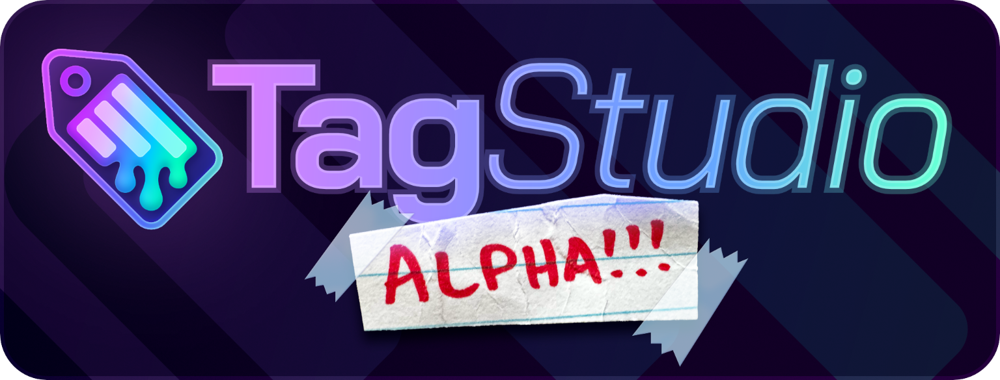
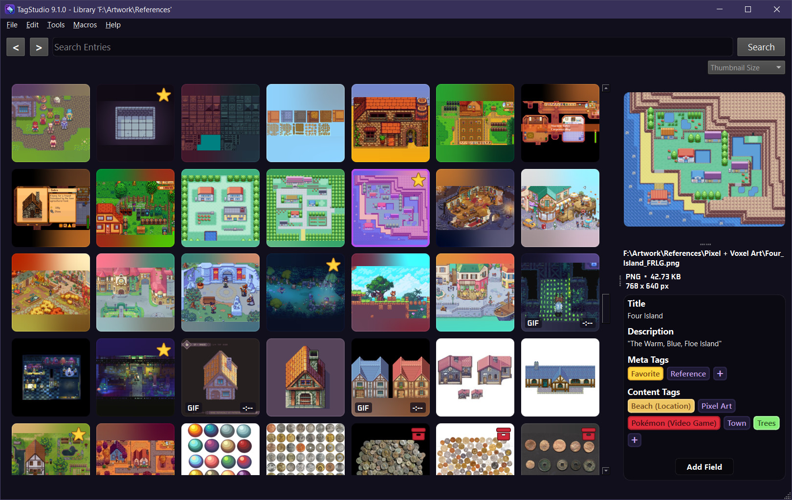

# TagStudio (Preview/Alpha): A User-Focused Document Management System

  

> [!CAUTION]
> This is still a **_very_** rough personal project of mine in its infancy. I’m open-sourcing it now in order to accept contributors sooner and to better facilitate the direction of the project from an earlier stage.
> There **_are_** bugs, and there will **_very likely_** be breaking changes!

TagStudio is a photo & file organization application with an underlying system that focuses on giving freedom and flexibility to the user. No proprietary programs or formats, no sea of sidecar files, and no complete upheaval of your filesystem structure.

  

## Contents
- [Goals](#goals)
- [Priorities](#priorities)
- [Current Features](#current-features)
- [Installation](#installation)
- [Usage](#usage)
- [FAQ](#faq)

## Goals

- To achieve a portable, privacy-oriented, open, extensible, and feature-rich system of organizing and rediscovering files.
- To provide powerful methods for organization, notably the concept of tag composition, or “taggable tags”.
- To create an implementation of such a system that is resilient against a user’s actions outside the program (modifying, moving, or renaming files) while also not burdening the user with mandatory sidecar files or otherwise requiring them to change their existing file structures and workflows.
- To support a wide range of users spanning across different platforms, multi-user setups, and those with large (several terabyte) libraries.
- To make the darn thing look like nice, too. It’s 2024, not 1994.

## Priorities

1. **The concept.** Even if TagStudio as a project or application fails, I’d hope that the idea lives on in a superior project. The [goals](#goals) outlined above don’t reference TagStudio once - _TagStudio_ is what references the _goals._
2. **The system.** Frontends and implementations can vary, as they should. The core underlying metadata management system is what should be interoperable between different frontends, programs, and operating systems. A standard implementation for this should settle as development continues. This opens up the doors for improved and varied clients, integration with third-party applications, and more.
3. **The application.** If nothing else, TagStudio the application serves as the first (and so far only) implementation for this system of metadata management. This has the responsibility of doing the idea justice and showing just what’s possible when it comes to user file management.
4. (The name.) I think it’s fine for an app or client, but it doesn’t really make sense for a system or standard. I suppose this will evolve with time.

## Current Features

- Create libraries/vaults centered around a system directory. Libraries contain a series of entries: the representations of your files combined with metadata fields. Each entry represents a file in your library’s directory, and is linked to its location.
- Add metadata to your library entries, including:
  - Name, Author, Artist (Single-Line Text Fields)
  - Description, Notes (Multiline Text Fields)
  - Tags, Meta Tags, Content Tags (Tag Boxes)
- Create rich tags composed of a name, a list of aliases, and a list of “subtags” - being tags in which these tags inherit values from.
- Search for entries based on tags, metadata, or filename (using `filename: <query>`)
- Special search conditions for entries that are: `untagged`/`no tags` and `empty`/`no fields`.

> [!NOTE]
> For more information on the project itself, please see the [FAQ](#faq) section and other docs.

## Installation
> [!CAUTION]
> TagStudio is only currently verified to work on Windows. I've run into issues with the Qt code running on Linux, but I don't know how severe these issues are. There's also likely bugs regarding filenames and portability of the databases across different OSes.

### Prerequisites

- Python 3.12

### Creating the Virtual Environment

*Skip this step if launching from the .sh script on Linux.*

1. In the root repository directory, create a python virtual environment:  
   `python3 -m venv .venv`
2. Activate your environment:

- Windows w/Powershell: `.venv\Scripts\Activate.ps1`
- Windows w/Command Prompt: `.venv\Scripts\activate.bat`
- Linux/macOS: `source .venv/bin/activate`

3. Install the required packages:  
   `pip install -r requirements.txt`

_Learn more about setting up a virtual environment [here](https://docs.python.org/3/tutorial/venv.html)._

### Launching

> [!NOTE]
> Depending on your system, Python may be called `python`, `py`, `python3`, or `py3`. These instructions use the alias `python3`. 

#### Optional Arguments

> `--open <path>` / `-o <path>`
> Path to a TagStudio Library folder to open on start.

#### Windows

To launch TagStudio, launch the `start_win.bat` file. You can modify this .bat file or create a shortcut and add one or more additional arguments if desired.

Alternatively, with the virtual environment loaded, run the python file at `tagstudio\tag_studio.py` from your terminal. If you're in the project's root directory, simply run `python3 tagstudio/tag_studio.py`.

> [!CAUTION]
> TagStudio on Linux & macOS likely won't function correctly at this time. If you're trying to run this in order to help test, debug, and improve compatibility, then charge on ahead!

#### macOS

With the virtual environment loaded, run the python file at "tagstudio/tag_studio.py" from your terminal. If you're in the project's root directory, simply run `python3 tagstudio/tag_studio.py`. When launching the program in the future, remember to activate the virtual environment each time before launching *(an easier method is currently being worked on).*

#### Linux

Run the "TagStudio.sh" script, and the program should launch! (Make sure that the script is marked as executable). Note that launching from the script from outside of a terminal will not launch a terminal window with any debug or crash information. If you wish to see this information, just launch the shell script directly from your terminal with `sh TagStudio.sh`.

##### NixOS

Use the provided `flake.nix` file to create and enter a working environment by running `nix develop`. Then, run the above `TagStudio.sh` script.

## Usage

### Creating/Opening a Library

With TagStudio opened, start by creating a new library or opening an existing one using File -> Open/Create Library from the menu bar. TagStudio will automatically create a new library from the chosen directory if one does not already exist. Upon creating a new library, TagStudio will automatically scan your folders for files and add those to your library (no files are moved during this process!).

### Refreshing the Library

In order to scan for new files or file changes, you’ll need to manually go to File -> Refresh Directories.

> [!NOTE]
> In the future, library refreshing will also be automatically done in the background, or additionally on app startup.

### Adding Metadata to Entries

To add a metadata field to a file entry, start by clicking the “Add Field” button under the file preview in the right-hand preview panel. From the dropdown menu, select the type of metadata field you’d like to add to the entry.

### Editing Metadata Fields

#### Text Line / Text Box

Hover over the field and click the pencil icon. From there, add or edit text in the dialog box popup.

#### Tag Box

Click the “+” button at the end of the Tags list, and search for tags to add inside the new dialog popup. Click the “+” button next to whichever tags you want to add. Alternatively, after you search for a tag, press the Enter/Return key to add the add the first item in the list. Press Enter/Return once more to close the dialog box

> [!WARNING]
> Keyboard control and navigation is currently _very_ buggy, but will be improved in future versions.

### Creating Tags

To create a new tag, click on Edit -> New Tag from the menu bar. From there, enter a tag name, shorthand name, any tag aliases separated by newlines, any subtags, and an optional color.

- The tag **shorthand** is a type of alias that displays in situations when screen space is more valuable (ex. as a subtag for other tags).
- **Aliases** are alternate names for a tag. These let you search for terms other than the exact tag name in order to find the tag again.
- **Subtags** are tags in which this tag is a child tag of. In other words, tags under this section are parents of this tag. For example, if you had a tag for a character from a show, you would make the show a subtag of this character. This would display as “Character (Show)” in most areas of the app. The first tag in this list is used as the tag shown in parentheses for specification.
- The **color** dropdown lets you select an optional color for this tag to display as.

### Editing Tags

To edit a tag, right-click the tag in the tag field of the preview pane and select “Edit Tag”

> [!WARNING]
> There is currently no method to view all tags that you’ve created in your library. This is a top priority for future releases.

### Relinking Renamed/Moved Files

Inevitably, some of the files inside your library will be renamed, moved, or deleted. If a file has been renamed or moved, TagStudio will display the thumbnail as a red tag with a cross through it _(this icon is also used for items with broken thumbnails)._ To relink moved files or delete these entries, go to Tools -> Manage Unlinked Entries. Click the “Refresh” button to scan your library for unlinked entries. Once complete, you can attempt to “Search & Relink” any unlinked entries to their respective files, or “Delete Unlinked Entries” in the event the original files have been deleted and you no longer wish to keep their metadata entries inside your library.

> [!WARNING]
> There is currently no method to relink entries to files that have been renamed - only moved or deleted. This is a top priority for future releases.

> [!WARNING]
> If multiple matches for a moved file are found (matches are currently defined as files with a matching filename as the original), TagStudio will currently ignore the match groups. Adding a GUI for manual selection, as well as smarter automated relinking, are top priorities for future versions.

### Saving the Library

Libraries are saved upon exiting the program. To manually save, select File -> Save Library from the menu bar. To save a backup of your library, select File -> Save Library Backup from the menu bar.

### Half-Implemented Features

#### Fix Duplicate Files

Load in a .dupeguru file generated by [dupeGuru](https://github.com/arsenetar/dupeguru/) and mirror metadata across entries marked as duplicates. After mirroring, return to dupeGuru to manage deletion of the duplicate files. After deletion, use the “Fix Unlinked Entries” feature in TagStudio to delete the duplicate set of entries for the now-deleted files

> [!CAUTION]
> While this feature is functional, it’s a pretty roundabout process and can be streamlined in the future.

#### Image Collage

Create an image collage of your photos and videos.

> [!CAUTION]
> Collage sizes and options are hardcoded.

#### Macros

Apply tags and other metadata automatically depending on certain criteria. Set specific macros to run when the files are added to the library. Part of this includes applying tags automatically based on parent folders.

> [!CAUTION]
> Macro options are hardcoded, and there’s currently no way for the user to interface with this (still incomplete) system at all.

#### Gallery-dl Sidecar Importing

Import JSON sidecar data generated by [gallery-dl](https://github.com/mikf/gallery-dl).

> [!CAUTION]
> This feature is not supported or documented in any official capacity whatsoever. It will likely be rolled-in to a larger and more generalized sidecar importing feature in the future.

## FAQ

### What State Is the Project Currently In?

As of writing (Alpha v9.1.0) the project is in a “useable” state, however it lacks proper testing and quality of life features. Currently the program has only been verified to work properly on Windows, and is unlikely to properly run on Linux or macOS in its current state, however this functionality is a priority going forward with testers.

### What Features Are You Planning on Adding?

Of the several features I have planned for the project, these are broken up into “priority” features and “future” features. Priority features were originally intended for the first public release, however are currently absent from the Alpha v9.x.x builds.

#### Priority Features

- Improved search
  - Sortable Search
  - Boolean Search
  - Coexisting Text + Tag Search
  - Searchable File Metadata
- Tag management view
- Applying metadata via multi-selection
- Easier ways to apply tags in bulk
  - Tag Search Panel
  - Recent Tags Panel
  - Top Tags Panel
  - Pinned Tags Panel
- Apply tags based on system folders
- Better (stable, performant) library grid view
- Improved entry relinking
- Cached thumbnails
- Collations
- Resizable thumbnail grid
- User-defined metadata fields
- Multiple directory support
- SQLite (or similar) save files
- Reading of EXIF and XMP fields
- Improved UI/UX
- Better internal API for accessing Entries, Tags, Fields, etc. from the library.
- Proper testing workflow
- Continued code cleanup and modularization
- Reassessment of save file structure in order to prioritize portability (leading to exportable tags, presets, etc)

#### Future Features

- Support for multiple simultaneous users/clients
- Draggable files outside the program
- Ability to ignore specific files
- A finished “macro system” for automatic tagging based on predetermined criteria.
- Different library views
- Date and time fields
- Entry linking/referencing
- Audio waveform previews
- 3D object previews
- Additional previews for miscellaneous file types
- Exportable/sharable tags and settings
- Optional global tags and settings, spanning across libraries
- Importing & exporting libraries to/from other programs
- Port to a more performant language and modern frontend (Rust?, Tauri?, etc.)
- Plugin system
- Local OCR search
- Support for local machine learning-based tag suggestions for images
- Mobile version

#### Features I Likely Won’t Add/Pull
- Native Cloud Integration 
  - There are plenty of services already (native or third-party) that allow you to mount your cloud drives as virtual drives on your system. Pointing TagStudio to one of these mounts should function similarly to what native integration would look like.
- Native ChatGPT/Non-Local LLM Integration
  - This could mean different things depending on what you're intending. Whether it's trying to use an LLM to replace the native search, or to trying to use a model for image recognition, I'm not interested in hooking people's TagStudio libraries into non-local LLMs such as ChatGPT and/or turn the program into a "chatbot" interface (see: [Goals/Privacy](#goals)). I wouldn't, however, mind using **locally** hosted models to provide the *optional* ability for additional searching and tagging methods (especially when it comes to facial recognition).

### Why Is the Version Already v9?

I’ve been developing this project over several years in private, and have gone through several major iterations and rewrites in that time. This “major version” is just a number at the end of the day, and if I wanted to I couldn’t released this as “Version 0” or “Version 1.0”, but I’ve decided to stick to my original version numbers to avoid needing to go in and change existing documentation and code comments. Version 10 is intended to include all of the “Priority Features” I’ve outlined in the [previous](#what-features-are-you-planning-on-adding) section. I’ve also labeled this version as an Alpha, and will likely reset the numbers when a feature-complete beta is reached.

### Wait, Is There a CLI Version?

As of right now, no. However, I _did_ have a CLI version in the recent past before dedicating my efforts to the Qt GUI version. I’ve left in the currently-inoperable CLI code just in case anyone was curious about it. Also yes, it’s just a bunch of glorified print statements (_the outlook for some form of curses on Windows didn’t look great at the time, and I just needed a driver for the newly refactored code...)._

### Can I Contribute?

**Yes!!** I recommend taking a look at the [Priority Features](#priority-features), [Future Features](#future-features), and [Features I Won't Pull](#features-i-likely-wont-addpull) lists, as well as the project issues to see what’s currently being worked on. Please do not submit pull requests with new feature additions without opening up an issue with a feature request first.

Code formatting is automatically checked via [ruff](https://docs.astral.sh/ruff/). To format your code, install ruff via `pip install -r requirements-dev.txt` and run `ruff format` 
