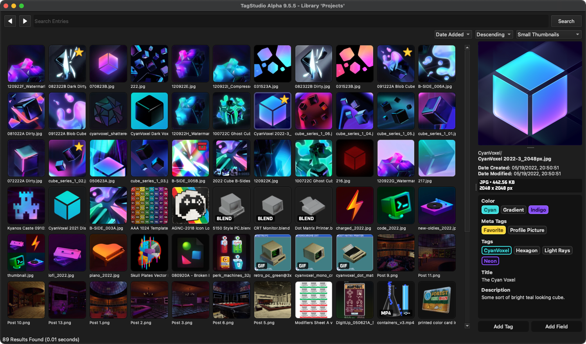

# TagStudio: A User-Focused Photo & File Management System

  

TagStudio is a photo & file organization application with an underlying tag-based system that focuses on giving freedom and flexibility to the user. No proprietary programs or formats, no sea of sidecar files, and no complete upheaval of your filesystem structure. **Read the documentation and more at [docs.tagstud.io](https://docs.tagstud.io)!**

  

  <i>TagStudio Alpha v9.5.5 running on macOS Sequoia.</i>

## Contents

-   [Feature Highlights](#feature-highlights)
-   [Basic Usage](#basic-usage)
-   [Installation](#installation)
-   [Goals & Priorities](#goals--priorities)
-   [FAQ](#faq)

Translation hosting generously provided by [Weblate](https://weblate.org/en/). Check out our [project page](https://hosted.weblate.org/projects/tagstudio/) to help translate TagStudio!

## Feature Highlights

### Libraries

A TagStudio library contains all of your tags, fields for a set of files based on one of your system directories. Similar to how Obsidian [vaults](https://help.obsidian.md/vault) function, TagStudio libraries act as a layer on top of your existing folders and file structure, and don't require your to move or duplicate files.

TagStudio places a `.TagStudio` folder in the folder you open as a library. Files included in your library are referred to as "entries", and are kept track of inside of a SQLite database inside the `.TagStudio` folder along with tags and other library data.

### File Entries

All file types are supported in TagStudio libraries, just not all have dedicated preview support. For a full list of filetypes with supported previews, see the "[Supported Previews](https://docs.tagstud.io/preview-support)" page on the documentation site. There's also playback support for videos, audio files, and supported animated image formats.

For a generalized list of what's currently supported:

-   **Images**
    -   Raster Images (JPEG, PNG, etc.)
    -   Vector (SVG)
    -   Animated (GIF, WEBP, APNG)
    -   RAW Formats
-   **Videos**
-   **Plaintext Files**
-   **Documents** _(If supported)_
-   **eBooks** _(If supported)_
-   **Photoshop PSDs**, **Blender Projects**, **Krita Projects**, and more!

### [Tags](https://docs.tagstud.io/tags) and [Fields](https://docs.tagstud.io/fields)

Tags represent an object or attribute - this could be a person, place, object, concept, and more. Unlike most tagging systems, TagStudio tags are not solely represented by a line of text or a hashtag. Tags in TagStudio consist of several properties and relationships that give extra customization, searching power, and ease of tagging that cannot be achieved by string-based tags alone. TagStudio tags are designed to be as simple or as complex as you'd like, giving options to users of all skill levels and use cases.

Tags currently consist of the following attributes:

-   **Name**: The full name for your tag. **_This does NOT have to be unique!_**
-   **Shorthand Name**: The shortest alternate name for your tag, used for abbreviations.
-   **Aliases**: Alternate names your tag goes by.
-   **Color**: The display color of your tag.
-   **Parent Tags**: Other tags in which this tag inherits from. In practice, this means that this tag can be substituted in searches for any listed parent tags.
    -   Parent tags checked with the "disambiguation" checkbox next to them will be used to help disambiguate tag names that may not be unique.
    -   For example: If you had a tag for "Freddy Fazbear", you might add "Five Nights at Freddy's" as one of the parent tags. If the disambiguation box is checked next to "Five Nights at Freddy's" parent tag, then the tag "Freddy Fazbear" will display as "Freddy Fazbear (Five Nights at Freddy's)". Furthermore, if the "Five Nights at Freddy's" tag has a shorthand like "FNAF", then the "Freddy Fazbear" tag will display as "Freddy Fazbear (FNAF)".
-   **Is Category**: A property that when checked, treats this tag as a category in the preview panel.

Fields, like tags, are additional peices of custom metadata that you can add to your file entries. Fields currently have several hardcoded names (e.g. "Title", "Author", "Series") but custom field names are planned for an upcoming update.

Field types currently include:

-   **Text Lines**: Single lines of text.
-   **Text Boxes**: Multi-line peices of text.
-   **Datetimes**: Dates and times.

### [Search](https://docs.tagstud.io/search)

-   Search for file entries based on tags, file path (`path:`), file types (`filetype:`), and even media types! (`mediatype:`). Path searches currently use [glob](<https://en.wikipedia.org/wiki/Glob_(programming)>) syntax, so you may need to wrap your filename or filepath in asterisks while searching. This will not be strictly necessary in future versions of the program.
-   Use and combine boolean operators (`AND`, `OR`, `NOT`) along with parentheses groups, quotation escaping, and underscore substitution to create detailed search queries
-   Use special search conditions (`special:untagged` and `special:empty`) to find file entries without tags or fields, respectively

## Basic Usage

> [!TIP]
> For more usage instructions, see the [documentation site](https://docs.tagstud.io/libraries)!

### Creating/Opening a Library

With TagStudio opened, start by creating a new library or opening an existing one using File -> Open/Create Library from the menu bar. TagStudio will automatically create a new library from the chosen directory if one does not already exist. Upon creating a new library, TagStudio will automatically scan your folders for files and add those to your library (no files are moved during this process!).

### Refreshing the Library

Libraries under 10,000 files automatically scan for new or modified files when opened. In order to refresh the library manually, select "Refresh Directories" under the File menu or by pressing <kbd>Ctrl</kbd></kbd>+<kbd>R</kbd> (macOS: <kbd>⌘ Command</kbd>+<kbd>R</kbd>).

### Creating Tags

Create a new tag by accessing the "New Tag" option from the Edit menu or by pressing <kbd>Ctrl</kbd>+<kbd>T</kbd> (macOS: <kbd>⌘ Command</kbd>+<kbd>T</kbd>). In the tag creation panel, enter a tag name, optional shorthand name, optional tag aliases, optional parent tags, and an optional color.

#### Tag Manager

You can manage your library of tags from opening the "Tag Manager" panel from Edit -> "Tag Manager" or by pressing <kbd>Ctrl</kbd>+<kbd>M</kbd> (macOS: <kbd>⌘ Command</kbd>+<kbd>M</kbd>). From here you can create, search for, edit, and permanently delete any tags you've created in your library.

### Editing Tags

To edit a tag, click on it inside the preview panel or right-click the tag and select "Edit Tag" from the context menu.

### Adding Tags to File Entries

Access the "Add Tag" search box by either clicking on the "Add Tag" button at the bottom of the right sidebar, accessing the "Add Tags to Selected" option from the File menu, or by pressing <kbd>Ctrl</kbd>+<kbd>Shift</kbd>+<kbd>T</kbd> (macOS: <kbd>⌘ Command</kbd>+<kbd>Shift</kbd>+<kbd>T</kbd>).

From here you can search for existing tags or create a new one if the one you're looking for doesn't exist. Click the "+" button next to any tags you want to to the currently selected file entries. To quickly add the top result, press the <kbd>Enter</kbd>/<kbd>Return</kbd> key to add the the topmost tag and reset the tag search. Press <kbd>Enter</kbd>/<kbd>Return</kbd> once more to close the dialog box. By using this method, you can quickly add various tags in quick succession just by using the keyboard!

To remove a tag from a file entry, hover over the tag in the preview panel and click on the "-" icon that appears.

### Adding Fields to File Entries

To add a metadata field to a file entry, start by clicking the "Add Field" button at the bottom of the preview panel. From the dropdown menu, select the type of metadata field you’d like to add to the entry

### Editing Fields

Hover over the field and click the pencil icon. From there, add or edit text in the dialog box popup.

### Relinking Moved Files

Inevitably some of the files inside your library will be renamed, moved, or deleted. If a file has been renamed or moved, TagStudio will display the thumbnail as a red broken chain link. To relink moved files or delete these entries, select the "Manage Unlinked Entries" option under the Tools menu. Click the "Refresh" button to scan your library for unlinked entries. Once complete, you can attempt to "Search & Relink" any unlinked file entries to their respective files, or "Delete Unlinked Entries" in the event the original files have been deleted and you no longer wish to keep their entries inside your library.

> [!WARNING]
> There is currently no method to relink entries to files that have been renamed - only moved or deleted. This is a high priority for future releases.

> [!WARNING]
> If multiple matches for a moved file are found (matches are currently defined as files with a matching filename as the original), TagStudio will currently ignore the match groups. Adding a GUI for manual selection, as well as smarter automated relinking, are high priorities for future versions.

See instructions in the "[Creating Development Environment](/CONTRIBUTING.md/#creating-a-development-environment)" section from the [contributing](https://docs.tagstud.io/contributing) page.

## Installation

To download executable builds of TagStudio, visit the [Releases](https://github.com/TagStudioDev/TagStudio/releases) page of the GitHub repository and download the latest release for your system under the "Assets" section at the bottom of the release.

TagStudio has builds for **Windows**, **macOS** _(Apple Silicon & Intel)_, and **Linux**. We also offer portable releases for Windows and Linux which are self-contained and easier to move around.

For detailed instructions, installation help, and instructions for developing for TagStudio, please see the "[Installation](https://docs.tagstud.io/install)" page on our documentation website.

> [!IMPORTANT]
> If you're interested in contributing to TagStudio, please take a look at the [contribution guidelines](https://docs.tagstud.io/contributing) for how to get started!

### Third-Party Dependencies

For video thumbnails and playback, you'll also need [FFmpeg](https://ffmpeg.org/download.html) installed on your system. If you encounter any issues with this, please reference our [FFmpeg Help](/docs/help/ffmpeg.md) guide. For faster library scanning and refreshing, it's also recommended you install [ripgrep](https://github.com/BurntSushi/ripgrep).

<!-- prettier-ignore -->
> [!CAUTION]
> **We do not currently publish TagStudio to any package managers. Any TagStudio distributions outside of the GitHub [Releases](https://github.com/TagStudioDev/TagStudio/releases) page are _unofficial_ and not maintained by us.**
>
> Installation support will not be given to users installing from unofficial sources. Use these versions at your own risk!

## Goals & Priorities

TagStudio aims to create an **open** and **robust** format for file tagging that isn't burdened by the limitations of traditional tagging and file metadata systems. **TagStudio** is the first proof-of-concept implementation of this system.

See the [**Roadmap**](docs/roadmap.md) on the documentation site for a complete list of planned features and estimated timeline.

### Overall Goals

-   To achieve a portable, private, extensible, open-format, and feature-rich system of organizing and rediscovering files.
-   To provide powerful methods for organization, notably the concept of tag inheritance, or "taggable tags" _(and in the near future, the combination of composition-based tags)._
-   To create an implementation of such a system that is resilient against a user’s actions outside the program (modifying, moving, or renaming files) while also not burdening the user with mandatory sidecar files or requiring them to change their existing file structures and workflows.
-   To support a wide range of users spanning across different platforms, multi-user setups, and those with large (several terabyte) libraries.
-   To make the dang thing look nice, too. It’s 2025, not 1995.

### Project Priorities

1. **The concept.** Even if TagStudio as an application fails, I’d hope that the idea lives on in a superior project. The goals outlined above don’t reference TagStudio once - _TagStudio_ is what references the _goals._
2. **The system.** Frontends and implementations can vary, as they should. The core underlying metadata management system is what should be interoperable between different frontends, programs, and operating systems. A standard implementation for this should settle as development continues. This opens up the doors for improved and varied clients, integration with third-party applications, and more.
3. **The application.** If nothing else, TagStudio the application serves as the first (and so far only) implementation for this system of metadata management. This has the responsibility of doing the idea justice and showing just what’s possible when it comes to user file management.

## FAQ

### Will TagStudio move, modify, or mess with my files?

**No**, outside of _explicit_ functionality such as "Move File(s) to Trash".

### Will TagStudio require me to recreate my tags or library in future updates?

**No.** It's our highest priority to ensure that your data safely and smoothly transfers over to newer versions.

### What state is the project currently in?

As of writing (Alpha v9.5.5) the project is very usable, however there's still some quirks and missing QoL features. Several additional features and changes are still planned (see: [roadmap](https://docs.tagstud.io/roadmap)) that add even more power and flexibility to the tagging and field systems while making it easier to tag in bulk and perform automated operations. Bugfixes and polishes are constantly trickling in along with the larger feature releases.

### What features are you planning on adding?

See the [roadmap](https://docs.tagstud.io/roadmap) page for the core features being planned and implemented for TagStudio. For a more up to date look on what's currently being added for upcoming releases, see our GitHub [milestones](https://github.com/TagStudioDev/TagStudio/milestones) for versioned releases.

The most important remaining features before I consider the program to be "feature complete" are:

-   Custom names for Fields
-   List views for files
-   Multiple root directory support for libraries
-   Improved file entry relinking
-   File entry groups
-   Sorting by file date modified and created
-   Macros
-   Improved search bar with visualized tags and improved autocomplete
-   Side panel for easier tagging (pinned tags, recent tags, tag search, tag palette)
-   Improved tag management interface
-   Improved and finalized Tag Categories
-   Fixed and improved mixed entry data displays (see: [#337](https://github.com/TagStudioDev/TagStudio/issues/337))
-   Sharable tag data
-   Separate core library + API

### What features will NOT be added?

-   Native Cloud Integration
    -   There are plenty of services already (native or third-party) that allow you to mount your cloud drives as virtual drives on your system. Hosting a TagStudio library on one of these mounts should function similarly to what native integration would look like.
    -   Supporting native cloud integrations such as these would be an unnecessary "reinventing the wheel" burden for us that is outside the scope of this project.
-   Native ChatGPT/Claude/Gemini/_Non-Local_ LLM Integration
    -   This could mean different things depending on your intentions. Whether it's trying to use an LLM to replace the native search, or to trying to use a model for image recognition, I'm not interested in hooking people's TagStudio libraries into non-local LLMs such as ChatGPT and/or turn the program into a "chatbot" interface (see: [Overall Goals/Privacy](#overall-goals)).
    -   With that being said, the future TagStudio API should be well-suited to connect to any sort of service you'd like, including machine learning models if so you choose. I just won't _personally_ add any native integrations with online services.

### Is a Rust port coming?

Not from us, or at least _not quite_. There are plans to break off the core TagStudio library into its own MIT-licensed module that can be used in other applications and plugins, and ideally this would be written in Rust. While I understand there's a lot of vocal support and volunteers willing to help with this, it's something that's better off coming at my/our own pace in order to ensure it's done correctly to align with the project's intentions and to remain maintainable in the future.

### Windows Defender thinks TagStudio is a virus or a trojan, why?

Unfortunately, executable Python applications "compiled" with something like PyInstaller are notorious for raising false positives in anti-virus software, most commonly Windows Defender (see: [#276](https://github.com/TagStudioDev/TagStudio/issues/276) and related issues). There's really not much we can do about this on our end, as the malware matches frequently change and sample submissions to Microsoft are slow and often ineffective. If you're effected by this, you may need to allow TagStudio to bypass your anti-virus software.

### Why is TagStudio already on version 9.x?

Over the first few years of private development the project went through several major iterations and rewrites. These major version bumps came quickly, and by the time TagStudio was opened-sourced the version number had already reached v9.0. Instead of resetting to "v0.0" or "v1.0" for this public release I decided to keep my v9.x numbering scheme and reserve v10.0 for when all the core features on the [roadmap](https://docs.tagstud.io/roadmap/) are implemented. I’ve also labeled this version as an "Alpha" and will drop this once either all of the core features are implemented or the project feels stable and feature-rich enough to be considered "Beta" and beyond.
