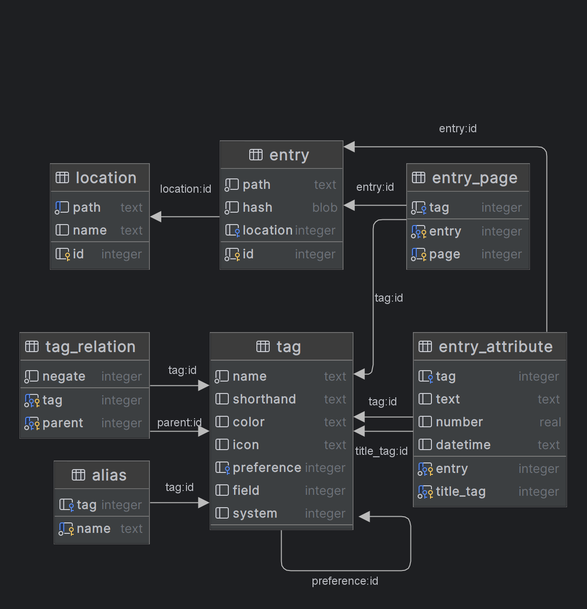

# Database Migration

The database migration is an upcoming refactor to TagStudio's library data storage system. The database will be migrated from a JSON-based one to a SQLite-based one. Part of this migration will include a reworked schema, which will allow for several new features and changes to how [tags](/doc/library/tag.md) and [fields](/doc/library/field.md) operate.

## Schema

### `alias` Table

_Description TBA_

### `entry` Table

_Description TBA_

### `entry_attribute` Table

_Description TBA_

### `entry_page` Table

_Description TBA_

### `location` Table

_Description TBA_

### `tag` Table

_Description TBA_

### `tag_relation` Table

_Description TBA_

## Resulting New Features and Changes

- Multiple Directory Support
- [Tag Categories](/doc/library/tag_categories.md) (Replaces [Tag Fields](/doc/library/field.md#tag_box))
- [Tag Overrides](/doc/library/tag_overrides.md)
- User-Defined [Fields](/doc/library/field.md)
- Tag Icons
