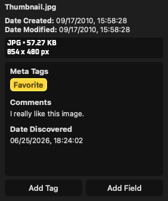
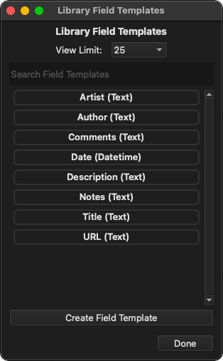
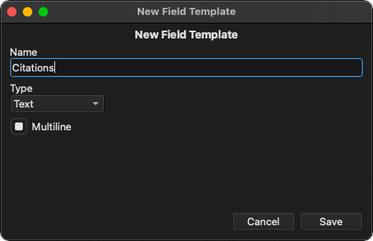
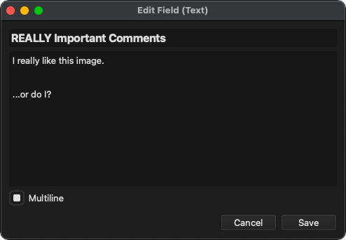
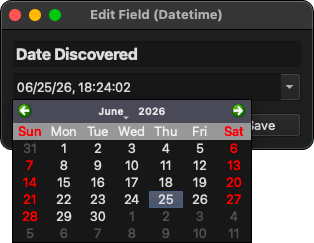

<!-- SPDX-FileCopyrightText: (c) TagStudio Contributors -->
<!-- SPDX-License-Identifier: GPL-3.0-only -->

# :material-text-box: Fields

Fields are extra pieces of information you can add to [file entries](./entries.md), similar to how [tags](tags.md) are added to entries. Fields are useful for storing information that doesn't nessisarily need to be a tag, such as titles, comments, notes, specific dates or times, etc.

To add a field to an entry, click the "Add Field" button in the preview panel. From there you can search and/or select a [field template](#field-templates) to choose from, or create a new one from the search bar. Alternatively you can create new field templates from **Edit -> Manage Field Templates**.

<figure markdown="span">
  
  <figcaption>Example of tags and various fields on a file entry.</figcaption>
</figure>

## :material-text-box-plus-outline: Field Templates

Field templates are handy templates to use when adding fields to entries that contain preconfigured options but no actual data. When you add a field to an entry from the "Add Field" button, you choose from a template to add and then fill in the information afterwards. TagStudio includes a handful of field templates to start you off with, but you're free to modify or delete them, or simply create your own.

Field templates can be viewed, created, and deleted from the **Edit -> Manage Field Templates** window. You can also edit field templates from the "Add Field" menu, and create new ones on the fly from the search bar. Note that you can not currently delete field templates from the "Add Field" menu, just like tags.

<figure markdown="span">
  
  <figcaption>Field Template Manager from <b>Edit -> Manage Field Templates</b>.</figcaption>
</figure>

<figure markdown="span">
  
  <figcaption>The field template editor, shown creating a new "Citations" field.</figcaption>
</figure>

## :material-format-list-bulleted-type: Field Types

Fields come in a variety of types that are better suited for different types of information, and may provide additional options unique to those types. Single lines are good for fields like titles, while multiline blocks are good for things like comments and notes.

### :material-text-box: Text

Text fields contain a piece of text with the option to display it either a single line or a multiline body of text.

| Option    | Value      | Description                                                              |
| --------- | ---------- | ------------------------------------------------------------------------ |
| Multiline | True/False | Indicates if the text should be displayed on multiple lines or just one. |

<figure markdown="span">
  
  <figcaption>The text field editor, editing a "Comments" field on an entry.</figcaption>
</figure>

### :material-calendar-month: Datetime

Datetime fields contain a date and time value. Dates are formatted using the format specified in your application settings.

<figure markdown="span">
  
  <figcaption>The datetime field editor, expanded to show the date picker.</figcaption>
</figure>
