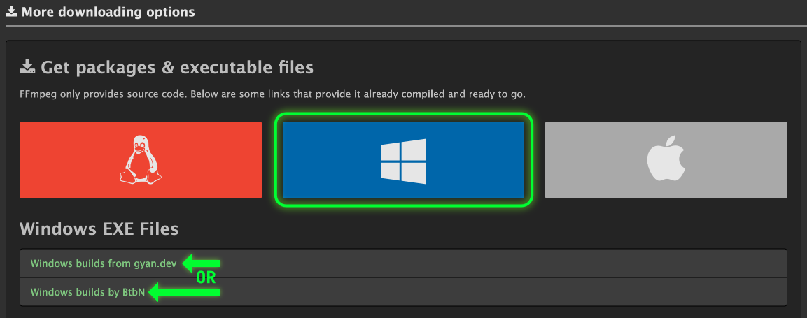

# FFmpeg

FFmpeg is required for thumbnail previews and playback features on audio and video files. FFmpeg is a free Open Source project dedicated to the handling of multimedia (video, audio, etc) files. For more information, see their official website at [ffmpeg.org](https://www.ffmpeg.org/).

## Installation on Windows

### Prebuilt Binaries

Pre-built binaries from trusted sources are available on the [FFmpeg website](https://www.ffmpeg.org/download.html). Under "More downloading options" click on the Windows section, then under "Windows EXE Files" select a source to download a build from. Follow any further download instructions from whichever build website you choose.

<!-- prettier-ignore -->
!!! warning
    Do NOT download the source code by mistake!

To Install:

1. Download 7z or zip file and extract it (right click > Extract All)
2. Move extracted contents to a unique folder (i.e; `c:\ffmpeg` or `c:\Program Files\ffmpeg`)
3. Add FFmpeg to your system PATH

    1. In Windows, search for or go to "Edit the system environment variables" under the Control Panel
    2. Under "User Variables", select "Path" then edit
    3. Click new and add `<Your folder>\bin` (e.g; `c:\ffmpeg\bin` or `c:\Program Files\ffmpeg\bin`)
    4. Click "Okay"

### Package Managers

FFmpeg is also available from:

1. WinGet (`winget install ffmpeg`)
2. Scoop (`scoop install main/ffmpeg`)
3. Chocolatey (`choco install ffmpeg-full`)

## Installation on Mac

### Homebrew

FFmpeg is available under the macOS section of the [FFmpeg website](https://www.ffmpeg.org/download.html) or can be installed via [Homebrew](https://brew.sh/) using `brew install ffmpeg`.

## Installation on Linux

### Package Managers

FFmpeg may be installed by default on some Linux distributions, but if not, it is available via your distro's package manager of choice:

1. Debian/Ubuntu (`sudo apt install ffmpeg`)
2. Fedora (`sudo dnf install ffmpeg-free`)
3. Arch (`sudo pacman -S ffmpeg`)

# Help

For additional help, please join the [Discord](https://discord.gg/hRNnVKhF2G) or create an Issue on the [GitHub repository](https://github.com/TagStudioDev/TagStudio)
