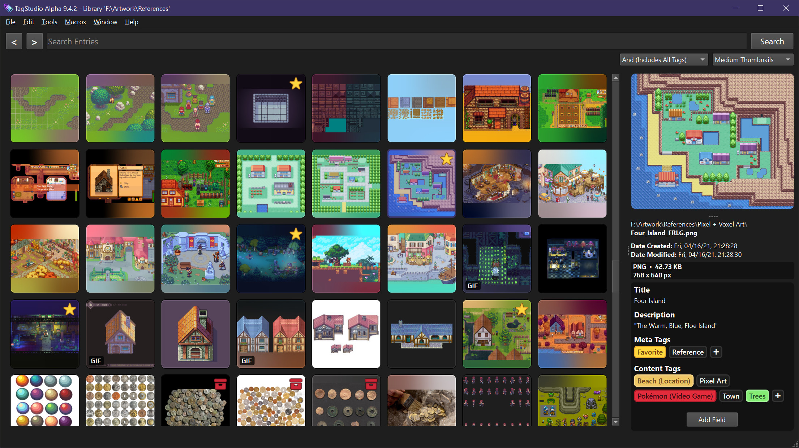

# Welcome to the TagStudio Documentation!

!!! warning
	This documentation is still a work in progress, and is intended to aide with deconstructing and understanding of the core mechanics of TagStudio and how it operates.

TagStudio is a photo & file organization application with an underlying system that focuses on giving freedom and flexibility to the user. No proprietary programs or formats, no sea of sidecar files, and no complete upheaval of your filesystem structure.

<figure markdown="span">
  
  <figcaption>TagStudio Alpha v9.1.0 running on Windows 10</figcaption>
</figure>

## Goals

- To achieve a portable, privacy-oriented, open, extensible, and feature-rich system of organizing and rediscovering files.
- To provide powerful methods for organization, notably the concept of tag composition, or “taggable tags”.
- To create an implementation of such a system that is resilient against a user’s actions outside the program (modifying, moving, or renaming files) while also not burdening the user with mandatory sidecar files or otherwise requiring them to change their existing file structures and workflows.
- To support a wide range of users spanning across different platforms, multi-user setups, and those with large (several terabyte) libraries.
- To make the darn thing look like nice, too. It’s 2024, not 1994.

## Priorities

1. **The concept.** Even if TagStudio as a project or application fails, I’d hope that the idea lives on in a superior project. The [goals](#goals) outlined above don’t reference TagStudio once - _TagStudio_ is what references the _goals._
2. **The system.** Frontends and implementations can vary, as they should. The core underlying metadata management system is what should be interoperable between different frontends, programs, and operating systems. A standard implementation for this should settle as development continues. This opens up the doors for improved and varied clients, integration with third-party applications, and more.
3. **The application.** If nothing else, TagStudio the application serves as the first (and so far only) implementation for this system of metadata management. This has the responsibility of doing the idea justice and showing just what’s possible when it comes to user file management.
4. (The name.) I think it’s fine for an app or client, but it doesn’t really make sense for a system or standard. I suppose this will evolve with time.

## Current Features

- Create libraries/vaults centered around a system directory. Libraries contain a series of entries: the representations of your files combined with metadata fields. Each entry represents a file in your library’s directory, and is linked to its location.
- Add metadata to your library entries, including:
	- Name, Author, Artist (Single-Line Text Fields)
	- Description, Notes (Multiline Text Fields)
	- Tags, Meta Tags, Content Tags (Tag Boxes)
- Create rich tags composed of a name, a list of aliases, and a list of “subtags” - being tags in which these tags inherit values from.
- Search for entries based on tags, ~~metadata~~ (TBA), or filenames/filetypes (using `filename: <query>`)
- Special search conditions for entries that are: `untagged`/`no tags` and `empty`/`no fields`.

## Important Updates

### [Database Migration](updates/db_migration.md)

The "Database Migration", "DB Migration", or "SQLite Migration" is an upcoming update to TagStudio which will replace the current JSON [library](library/index.md) with a SQL-based one, and will additionally include some fundamental changes to how some features such as [tags](library/tag.md) will work.
