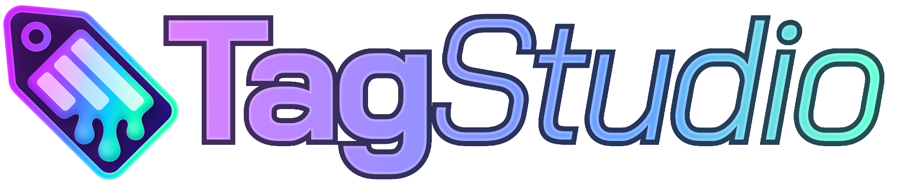
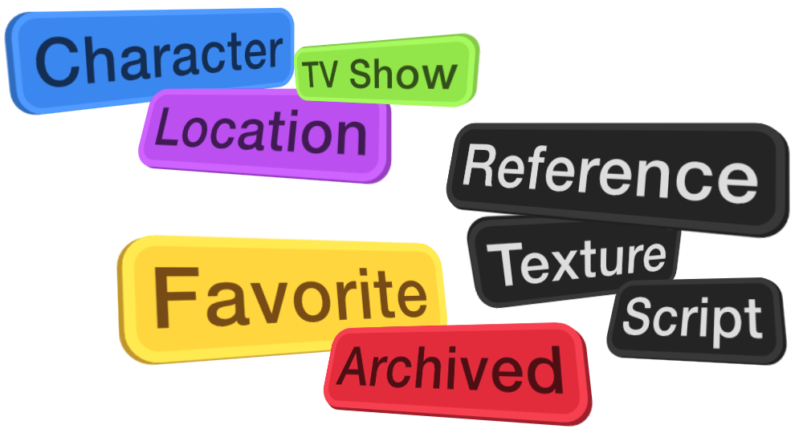

#

<link rel="stylesheet" href="stylesheets/home.css">

<figure markdown="span">
  { width=80% }<h2>A User-Focused Photo & File Management System</h2>
</figure>

 

<figure markdown="span">
  { width=80% }
  <figcaption>TagStudio Alpha v9.5.0 running on macOS Sequoia.</figcaption>
</figure>

**TagStudio** is a photo & file organization application with an underlying tag-based system that focuses on giving freedom and flexibility to the user. No proprietary programs or formats, no sea of sidecar files, and no complete upheaval of your filesystem structure.

<figure markdown="span">
  [:material-download: Download Latest Release](https://github.com/TagStudioDev/TagStudio/releases){ .md-button .md-button--primary }
</figure>

## :material-star: Core Features

-   :material-file-multiple:{ .lg .middle } **[All Files](entries.md) Welcome**

    ***

    TagStudio works with photos, videos, music, documents, and more! **All file types** are recognized by TagStudio, with most common ones having built-in preview support.

    [:material-arrow-right: See Full Preview Support](preview-support.md)

-   :material-tag-text:{ .lg .middle } **Create [Tags](tags.md) Your Way**

    ***

    -   :material-format-font: No character restrictions
    -   :material-form-textbox: Add aliases/alternate names
    -   :material-palette: Customize colors and styles
    -   :material-tag-multiple: Tags can be tagged with other tags!
    -   :material-star-four-points: And more!

-   :material-magnify:{ .lg .middle } **Powerful [Search](search.md)**

    ***

    -   Full [Boolean operator](search.md) support
    -   Filenames, paths, and extensions with [glob](<https://en.wikipedia.org/wiki/Glob_(programming)>) syntax
    -   General media types (e.g. "Photo", "Video", "Document")
    -   Special searches (e.g. "Untagged")
    -   "[Smartcase](search.md#case-sensitivity)" case sensitivity

-   :material-text-box:{ .lg .middle } **Text and Date [Fields](fields.md)**

    ***

    Along with tags, add custom metadata fields such as text and dates to your files!

    This is useful for adding notes and descriptions, titling files, and keeping track of extra dates and times.

## :material-toolbox: Built Different

-   :material-scale-balance:{ .lg .middle } **Open Source**

    ***

    TagStudio is licensed under the GPL-3.0 license with the source code and executable releases available on [GitHub](https://github.com/TagStudioDev/TagStudio).

    [:material-arrow-right: View License](https://github.com/TagStudioDev/TagStudio/blob/main/LICENSE)

    [:material-arrow-right: Roadmap to MIT Core Library License](roadmap.md#core-library-api)

-   :material-database:{ .lg .middle } **Central Save File**

    ***

    Apposed to filling your drives with [sidecar files](https://en.wikipedia.org/wiki/Sidecar_file), TagStudio uses a project-like [library](libraries.md) system that stores your tags and metadata inside a single save file per-library.

    [:material-arrow-right: Learn About the Format](libraries.md)

---

## :material-layers-triple: More Than an Application

TagStudio aims to create an **open** and **robust** format for file tagging that isn't burdened by the limitations of traditional tagging and file metadata systems. **TagStudio** is the first proof-of-concept implementation of this system.

-   :material-map-check:{ .lg .middle } See the [**Roadmap**](roadmap.md) for future features and updates

