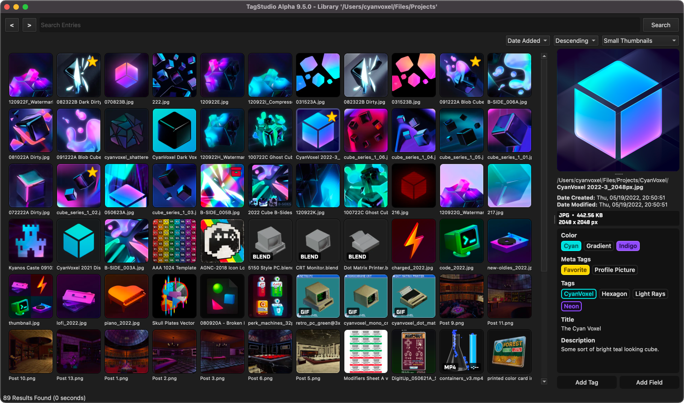

# Welcome to the TagStudio Documentation!

TagStudio is a photo & file organization application with an underlying tag-based system that focuses on giving freedom and flexibility to the user. No proprietary programs or formats, no sea of sidecar files, and no complete upheaval of your filesystem structure.

<figure width="60%" markdown="span">

  
  
  <figcaption>TagStudio Alpha v9.5.0 running on macOS Sequoia.</figcaption>

</figure>

## Feature Roadmap

The [Feature Roadmap](updates/roadmap.md) lists all of the planned core features for TagStudio to be considered "feature complete" along with estimated release milestones. The development and testing of these features takes priority over all other requested or submitted features unless they are later added to this roadmap. This helps ensure that TagStudio eventually sees a full release and becomes more usable by more people more quickly.

## Current Features

### Libraries

-   Create [libraries](./library/index.md) centered around a system directory. Libraries contain a series of entries: the representations of your files combined with metadata fields. Each entry represents a file in your library’s directory, and is linked to its location.
-   Address moved, deleted, or otherwise "unlinked" files by using the "Fix Unlinked Entries" option in the Tools menu.

### Tagging + Metadata Fields

-   Add custom powerful [tags](./library/tag.md) to your library entries
-   Add [metadata fields](./library/field.md) to your library entries, including:
    -   Name, Author, Artist (Single-Line Text Fields)
    -   Description, Notes (Multiline Text Fields)
-   Create rich tags composed of a name, color, a list of aliases, and a list of “parent tags” - these being tags in which these tags inherit values from.
-   Copy and paste tags and fields across file entries
-   Automatically organize tags into groups based on parent tags marked as "categories"
-   Generate tags from your existing folder structure with the "Folders to Tags" macro (NOTE: these tags do NOT sync with folders after they are created)

### Search

-   [Search](./library/library_search.md) for file entries based on tags, file path (`path:`), file types (`filetype:`), and even media types! (`mediatype:`)
-   Use and combine boolean operators (`AND`, `OR`, `NOT`) along with parentheses groups, quotation escaping, and underscore substitution to create detailed search queries
-   Use special search conditions (`special:untagged`) to find file entries without tags or fields, respectively

### File Entries

-   Nearly all [file](./library/entry.md) types are supported in TagStudio libraries - just not all have dedicated thumbnail support.
-   Preview most image file types, animated GIFs, videos, plain text documents, audio files, Blender projects, and more!
-   Open files or file locations by right-clicking on thumbnails and previews and selecting the respective context menu options. You can also click on the preview panel image to open the file, and click the file path label to open its location.
-   Delete files from both your library and drive by right-clicking the thumbnail(s) and selecting the "Move to Trash"/"Move to Recycle Bin" option.
