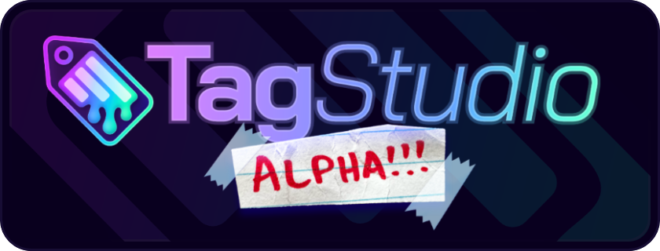

# Welcome to the TagStudio Documentation!

!!! warning
This documentation is still a work in progress, and is intended to aide with deconstructing and understanding of the core mechanics of TagStudio and how it operates.

TagStudio is a photo & file organization application with an underlying tag-based system that focuses on giving freedom and flexibility to the user. No proprietary programs or formats, no sea of sidecar files, and no complete upheaval of your filesystem structure.

<figure width="60%" markdown="span">
  
  <figcaption>TagStudio Alpha v9.4.2 running on Windows 10</figcaption>
</figure>

## Goals

- To achieve a portable, private, extensible, open-format, and feature-rich system of organizing and rediscovering files.
- To provide powerful methods for organization, notably the concept of tag inheritance, or “taggable tags” _(and in the near future, the combination of composition-based tags)._
- To create an implementation of such a system that is resilient against a user’s actions outside the program (modifying, moving, or renaming files) while also not burdening the user with mandatory sidecar files or requiring them to change their existing file structures and workflows.
- To support a wide range of users spanning across different platforms, multi-user setups, and those with large (several terabyte) libraries.
- To make the darn thing look like nice, too. It’s 2024, not 1994.

## Priorities

1. **The concept.** Even if TagStudio as an application fails, I’d hope that the idea lives on in a superior project. The [goals](#goals) outlined above don’t reference TagStudio once - _TagStudio_ is what references the _goals._
2. **The system.** Frontends and implementations can vary, as they should. The core underlying metadata management system is what should be interoperable between different frontends, programs, and operating systems. A standard implementation for this should settle as development continues. This opens up the doors for improved and varied clients, integration with third-party applications, and more.
3. **The application.** If nothing else, TagStudio the application serves as the first (and so far only) implementation for this system of metadata management. This has the responsibility of doing the idea justice and showing just what’s possible when it comes to user file management.
4. (The name.) I think it’s fine for an app or client, but it doesn’t really make sense for a system or standard. I suppose this will evolve with time...

## Feature Roadmap

The [Feature Roadmap](updates/roadmap.md) lists all of the planned core features for TagStudio to be considered "feature complete" along with estimated release milestones. The development and testing of these features takes priority over all other requested or submitted features unless they are later added to this roadmap. This helps ensure that TagStudio eventually sees a full release and becomes more usable by more people more quickly.

## Current Features

### Libraries

- Create libraries/vaults centered around a system directory. Libraries contain a series of entries: the representations of your files combined with metadata fields. Each entry represents a file in your library’s directory, and is linked to its location.
- Address moved, deleted, or otherwise "unlinked" files by using the "Fix Unlinked Entries" option in the Tools menu.

### Metadata + Tagging

- Add metadata to your library entries, including:
  - Name, Author, Artist (Single-Line Text Fields)
  - Description, Notes (Multiline Text Fields)
  - Tags, Meta Tags, Content Tags (Tag Boxes)
- Create rich tags composed of a name, a list of aliases, and a list of “parent tags” - being tags in which these tags inherit values from.
- Copy and paste tags and fields across file entries
- Generate tags from your existing folder structure with the "Folders to Tags" macro (NOTE: these tags do NOT sync with folders after they are created)

### Search

- Search for entries based on tags, ~~metadata~~ (TBA), or filenames/filetypes (using `filename: <query>`).
- Special search conditions for entries that are: `untagged` and `empty`.

### File Entries

- All\* file types are supported in TagStudio libraries - just not all have dedicated thumbnail support.
- Preview most image file types, animated GIFs, videos, plain text documents, audio files\*\*, Blender projects, and more!
- Open files or file locations by right-clicking on thumbnails and previews and selecting the respective context menu options. You can also click on the preview panel image to open the file, and click the file path label to open its location.
- Delete files from both your library and drive by right-clicking the thumbnail(s) and selecting the "Move to Trash"/"Move to Recycle Bin" option.

> - _\* Weird files with no extension or files such as ".\_DS_Store" currently have limited support._
> - _\*\* Audio playback coming in v9.5_
