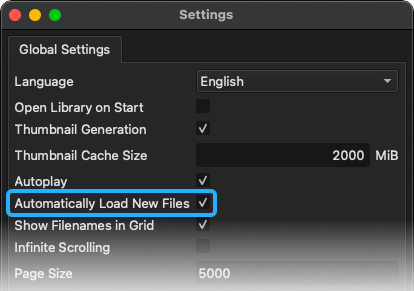
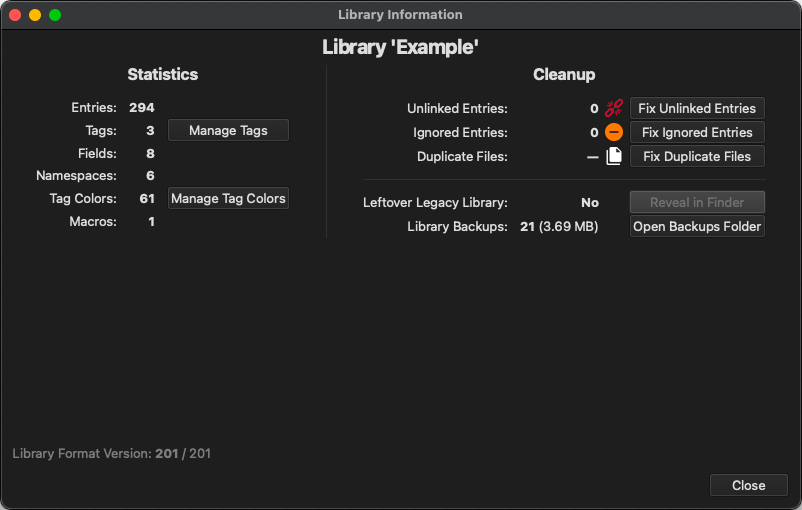

<!-- SPDX-FileCopyrightText: (c) TagStudio Contributors -->
<!-- SPDX-License-Identifier: GPL-3.0-only -->

# :material-database: Libraries

A TagStudio library represents a folder of content (photos, documents, or [any other files](preview-support.md)) and contains TagStudio data specific to that library ([tags](tags.md), [fields](fields.md), [colors](colors.md), etc.) along with the associations between that data and your files. A library folder can be stored locally on your computer, on an external drive, on a network drive/NAS, or most other locations accessible by your system. TagStudio passively and non-destructively includes contents of this folder (including subfolders) in your library as [file entries](entries.md).

**Your files are not _moved_, _copied_, or _modified_ in any way!**

<!-- prettier-ignore -->
!!! note "Planned Library Features & Changes"
    - The *option* to **store library data separately** from library content
        - This will enable TagStudio libraries to be created for read-only folders
        - This will enable TagStudio to have different libraries for the same content folder(s)
    - **Multi-root libraries** that can read from multiple content folders
        - This will reduce the need for using complex [`.ts_ignore`](ignore.md) rules
        - This will enable having library content that spans across different drives, most notably on Windows, without the need for OS-dependant workarounds such as symlinks
    - Sharable tag packs and color packs
    - Global tags, accessible across different libraries

    See the [Roadmap](roadmap.md#library) for more information.

## :material-database-plus: Creating/Opening a Library

To create or open a [library](libraries.md), go to **File -> Open/Create Library** in the menu bar or use <kbd>Ctrl</kbd>+<kbd>O</kbd> (<kbd>⌘ Command </kbd>+<kbd>O</kbd> on macOS) and chose a folder with file contents you'd like to use as a TagStudio library. If a `.TagStudio` folder doesn't already exist inside the directory, TagStudio will create one and automatically scan the folder for files to include. Otherwise, the pre-existing library is opened.

<!-- prettier-ignore -->
!!! info "Legacy Library Migration"
    If you open a library created with TagStudio **v9.4.2 or earlier** in **[v9.5.0](changelog.md#950-march-3rd-2025) or later**, you'll be walked through a migration process that converts the old `ts_library.json` save file to the new `ts_library.sqlite` format. The original JSON file is preserved and can be easily deleted from the **View -> Library Information** panel once you're satisfied with the migration.

## :material-database-refresh: Refreshing Directories

TagStudio automatically scans for new or updated files when opening a library by default. This behavior can be toggled in the settings if your library is very large and/or located on a slow drive.



To manually refresh your library at any time, use **File -> Refresh Directories** from the menu or by using <kbd>Ctrl</kbd>+<kbd>R</kbd> (<kbd>⌘ Command </kbd>+<kbd>R</kbd> on macOS).

## :material-database-cog: Library Information Panel

The "Library Information" panel can be accessed from **Tools -> Library Information** in the menu bar, and includes various statistics about your library along with quick access to managing common library cleanup tasks such as relinking entries, updating ignored files, and managing library data backups.



## :material-database-clock: Saving and Creating Backups

As of v9.5.0, libraries save automatically as you work.

To create a timestamped backup of your library save file, go to **File -> Save Library Backup** or use <kbd>Ctrl</kbd>+<kbd>Shift</kbd>+<kbd>S</kbd> (<kbd>⌘ Command </kbd>+<kbd>Shift</kbd>+<kbd>S</kbd> on macOS). Backups are also automatically created whenever the database file is migrated to a newer version as a precautionary measure. Backups currently _only_ include your `ts_library.sqlite` file, as that's the database file that contains your core TagStudio data. Your own files are **not** part of any of these backups.

Backups are stored inside the library data folder under `.TagStudio/backups/` and can be managed from the **Tools -> Library Information** panel.

## :material-folder: Library Data Folder

When you create a library, TagStudio creates a hidden `.TagStudio` folder at the root of the chosen content folder. This "data folder" contains all TagStudio data for that library. Library data includes what files are included in your library, what [tags](tags.md) you've created in that library, which files have what tags, and more. Note that this means tags you create only exist _per-library_. Global tags that are accessible across libraries are planned for a [future update](roadmap.md#library).

### :material-file-tree: Data Folder Structure

The library data folder (currently only named `.TagStudio`) is internally structured as follows:

| File/Folder         | Description                                                                                                                                                      |
| ------------------- | ---------------------------------------------------------------------------------------------------------------------------------------------------------------- |
| `ts_library.sqlite` | The library save file. Stores all entries, tags, fields, and other metadata. _(v9.5.0+)_                                                                         |
| `.ts_ignore`        | An optional ["ignore" file](ignore.md) for excluding files and folders from library scans, similar to a [`.gitignore`](https://git-scm.com/docs/gitignore) file. |
| `backups/`          | Timestamped backups of the library save file.                                                                                                                    |
| `thumbs/`           | Thumbnail images for file previews.                                                                                                                              |

```yaml title="Library Folder Example"
My Library/ # (Content Folder)
├─ file_1.jpg
├─ file_2.txt
├─ .TagStudio/ # (Data Folder)
│ ├─ ts_library.sqlite (References outer folder for files)
│ ├─ .ts_ignore
│ ├─ backups/
│ ├─ thumbs/
```

### :material-bag-suitcase: Library Portability

Because the `.TagStudio` _data folder_ is located in your library _content folder_, and it stores all file entry paths _relative_ to the content folder, your library folder can be freely moved to another location without files becoming [unlinked](entries.md#unlinked-entries). This also means that if you have a TagStudio library stored on an external drive, it can be freely moved around to different computers running TagStudio with no issues. Likewise, if your library is located on a network drive or NAS, you can access it from different computers that may map the network location differently from each other _(note that TagStudio currently does not support multiple users accessing the same library at once)._
