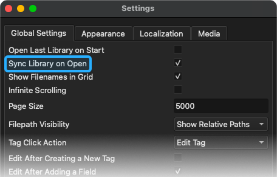
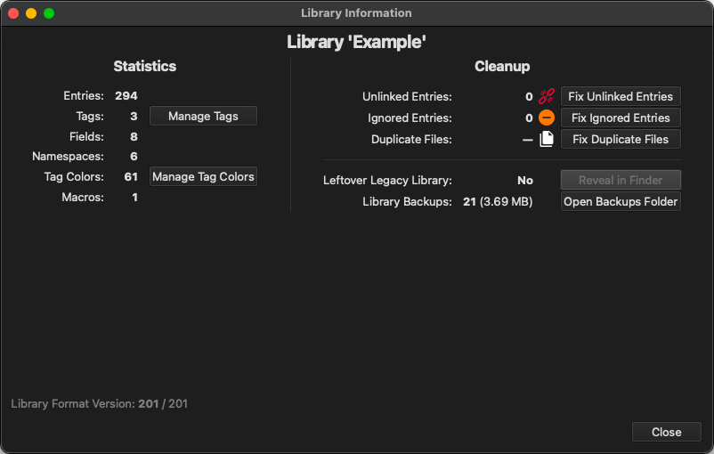

<!-- SPDX-FileCopyrightText: (c) TagStudio Contributors -->
<!-- SPDX-License-Identifier: GPL-3.0-only -->

# :material-database: Libraries

A TagStudio library represents a folder of content (photos, documents, or [any other files](preview-support.md)) and contains TagStudio data specific to that library ([tags](tags.md), [fields](fields.md), [colors](colors.md), etc.) along with the associations between that data and your files. A library folder can be stored locally on your computer, on an external drive, on a network drive/NAS, or most other locations accessible by your system. TagStudio passively and non-destructively includes contents of this folder (including subfolders) in your library as [file entries](entries.md).

**Your files are not _moved_, _copied_, or _modified_ in any way!**

<!-- prettier-ignore -->
!!! note "Planned Library Features & Changes"
    - The *option* to **store library data separately** from library content
        - This will enable TagStudio libraries to be created for read-only folders
        - This will enable TagStudio to have different libraries for the same content folder(s)
    - **Multi-root libraries** that can read from multiple content folders
        - This will reduce the need for using complex [`.ts_ignore`](ignore.md) rules
        - This will enable having library content that spans across different drives, most notably on Windows, without the need for OS-dependant workarounds such as symlinks
    - Sharable tag packs and color packs
    - Global tags, accessible across different libraries

    See the [Roadmap](roadmap.md#library) for more information.

## :material-database-plus: Creating/Opening a Library

To create or open a [library](libraries.md), go to **File -> Open/Create Library** in the menu bar or use <kbd>Ctrl</kbd>+<kbd>O</kbd> (<kbd>⌘ Command </kbd>+<kbd>O</kbd> on macOS) and chose a folder with file contents you'd like to use as a TagStudio library. If a `.TagStudio` folder doesn't already exist inside the directory, TagStudio will create one and automatically scan the folder for files to include. Otherwise, the pre-existing library is opened.

<!-- prettier-ignore -->
!!! info "Legacy Library Migration"
    If you open a library created with TagStudio **v9.4.2 or earlier** in **[v9.5.0](changelog.md#950-march-3rd-2025) or later**, you'll be walked through a migration process that converts the old `ts_library.json` save file to the new `ts_library.sqlite` format. The original JSON file is preserved and can be easily deleted from the **View -> Library Information** panel once you're satisfied with the migration.

## :material-database-sync: Library Syncing

A TagStudio library gets synced with the files found in your chosen content folders and certain metadata attributes (e.g. stats) found on those files. This is a **non-destructive, read-only** process and none of your content files are moved, modified, or deleted. Syncing is indicated by a temporary progress bar, and you can continue to use TagStudio normally while syncing occurs.

Syncing automatically occurs when you open a library by default, and you can manually sync a library at any time by going to **File -> Sync Library** in the menubar to by pressing <kbd>Ctrl</kbd>+<kbd>R</kbd> (<kbd>⌘ Command </kbd>+<kbd>R</kbd> on macOS). If you do not wish for your library to be synced when opened, you can disable this behavior in the settings.

<figure markdown="span">
  
  <figcaption>
  Settings -> Sync Library on Open
  </figcaption>
</figure>

### :material-link-variant: Automatic Relinking

Unlinked entries are file entries in your TagStudio library that have become "unlinked" from their original file on disk, likely as a result of the original file being renamed, moved, or deleted. TagStudio attempts to automatically relink any of these entries as a part of the syncing process, but there are some scenarios where automatic relinking is not possible or too ambiguous and requires a manual review. Below is a complete table of every scenario in which file entries can become unlinked, and whether or not TagStudio can auto-relink them:

|     Case | File Moved? | File Renamed? | File Modified? | Unlinked Entries | Matched Files |             Auto-Relink             |
| -------: | :---------: | :-----------: | :------------: | :--------------: | :-----------: | :---------------------------------: |
|  **\#0** |    _No_     |     _No_      |    **Yes**     |        0         |       —       | :material-minus-circle:{.lg .gray}  |
|  **\#1** |      —      |       —       |       —        |        1         |       0       |  :material-close-circle:{.lg .red}  |
|  **\#2** |   **Yes**   |    **Yes**    |    **Yes**     |        1         |       0       |  :material-close-circle:{.lg .red}  |
|  **\#3** |   **Yes**   |    **Yes**    |      _No_      |        1         |       1       | :material-check-circle:{.lg .green} |
|  **\#4** |   **Yes**   |    **Yes**    |      _No_      |        1         |      2+       |  :material-close-circle:{.lg .red}  |
|  **\#5** |   **Yes**   |    **Yes**    |      _No_      |        2+        |      Any      |  :material-close-circle:{.lg .red}  |
|  **\#6** |   **Yes**   |     _No_      |    **Yes**     |        1         |       1       | :material-check-circle:{.lg .green} |
|  **\#7** |   **Yes**   |     _No_      |      _No_      |        1         |       1       | :material-check-circle:{.lg .green} |
|  **\#8** |   **Yes**   |     _No_      |      _No_      |        1         |      2+       |  :material-close-circle:{.lg .red}  |
|  **\#9** |   **Yes**   |     _No_      |      _No_      |        2+        |      Any      |  :material-close-circle:{.lg .red}  |
| **\#10** |    _No_     |    **Yes**    |    **Yes**     |        1         |       0       |  :material-close-circle:{.lg .red}  |
| **\#11** |    _No_     |    **Yes**    |      _No_      |        1         |       1       | :material-check-circle:{.lg .green} |
| **\#12** |    _No_     |    **Yes**    |      _No_      |        1         |      2+       |  :material-close-circle:{.lg .red}  |
| **\#13** |    _No_     |    **Yes**    |      _No_      |        2+        |      Any      |  :material-close-circle:{.lg .red}  |

#### Explanations

- **Case \#0**: _Modifying file content alone does not create unlinked entries._
- **Case \#1**: If the original file was deleted, no matches will be found. TagStudio leaves the decision to delete entries up to the user.
- **Case \#2**: If the original file bears no similarities to the unlinked entry anymore, it is indistinguishable from a deleted or new file.
- **Case \#3**: The file has been moved and renamed with a high degree of confidence.
- **Case \#4**: If more than one file is matched with the same stats, the case is too ambiguous.
- **Case \#5**: If two or more entries share the same stats, it's not clear which entry a matched file belongs to.
- **Case \#6**: The file has been moved and modified, but since no other file shares its filename, it is assumed to be the same file with a decent degree of confidence.
- **Case \#7**: The original file has been moved with a high degree of confidence.
- **Case \#8**: If multiple copies of the same moved file are matched in different locations, the case is ambiguous.
- **Case \#9**: _Similar to **\#5**._ If two or more entries share the same filename and stats, it's not clear which entry a matched file belongs to.
- **Case \#10**: _Same as **\#2**._
- **Case \#11**: The file has been renamed with a high degree of confidence.
- **Case \#12**: _Same as **\#4**._
- **Case \#13**: _Same as **\#5**._

Every numbered case above assumes the entry has saved file metadata attributes to help match against (added in **v9.7**), in which case the **file modification date** combined with the **file size** is used as a soft file signature to aid in scenarios such as renames or moves. If no file metadata is stored with the file entry, or if this soft file signature doesn't lead to a confident match, TagStudio falls back to matching by filename alone: a single file found with that name is automatically relinked, while zero or multiple filename matches leave the entry unlinked for manual review.

<!-- prettier-ignore -->
!!! warning
    There's currently no way to manually specify which remaining unlinked entries should be linked with which files, only to delete the entries from the library. Manual relinking is a high priority feature for future releases.

<!-- prettier-ignore -->
!!! warning "Switching from a Case-Sensitive to Case-Insensitive Filesystem (i.e. Windows)"
    If you switch from using TagStudio on a computer with a case-sensitive filesystem to one with a *case-insensitive* one, TagStudio will treat any entries added up to this point with the same filepath + name under case-insensitivity as duplicate entries and merge them. The automatic relinking process will also take case-insensitivity into account when relinking entries.

    Currently, TagStudio only uses this case-insensitivity mode when running on Windows. Future versions will be more precise about this distinction, with the aim of determining the case sensitivity on a per-drive basis.

## :material-database-cog: Library Information Panel

The "Library Information" panel can be accessed from **Tools -> Library Information** in the menu bar, and includes various statistics about your library along with quick access to managing common library cleanup tasks such as relinking entries, updating ignored files, and managing library data backups.



## :material-database-clock: Saving and Creating Backups

As of v9.5.0, libraries save automatically as you work.

To create a timestamped backup of your library save file, go to **File -> Save Library Backup** or use <kbd>Ctrl</kbd>+<kbd>Shift</kbd>+<kbd>S</kbd> (<kbd>⌘ Command </kbd>+<kbd>Shift</kbd>+<kbd>S</kbd> on macOS). Backups are also automatically created whenever the database file is migrated to a newer version as a precautionary measure. Backups currently _only_ include your `ts_library.sqlite` file, as that's the database file that contains your core TagStudio data. Your own files are **not** part of any of these backups.

Backups are stored inside the library data folder under `.TagStudio/backups/` and can be managed from the **Tools -> Library Information** panel.

## :material-folder: Library Data Folder

When you create a library, TagStudio creates a hidden `.TagStudio` folder at the root of the chosen content folder. This "data folder" contains all TagStudio data for that library. Library data includes what files are included in your library, what [tags](tags.md) you've created in that library, which files have what tags, and more. Note that this means tags you create only exist _per-library_. Global tags that are accessible across libraries are planned for a [future update](roadmap.md#library).

### :material-file-tree: Data Folder Structure

The library data folder (currently only named `.TagStudio`) is internally structured as follows:

| File/Folder         | Description                                                                                                                                                      |
| ------------------- | ---------------------------------------------------------------------------------------------------------------------------------------------------------------- |
| `ts_library.sqlite` | The library save file. Stores all entries, tags, fields, and other metadata. _(v9.5.0+)_                                                                         |
| `.ts_ignore`        | An optional ["ignore" file](ignore.md) for excluding files and folders from library scans, similar to a [`.gitignore`](https://git-scm.com/docs/gitignore) file. |
| `backups/`          | Timestamped backups of the library save file.                                                                                                                    |
| `thumbs/`           | Thumbnail images for file previews.                                                                                                                              |

```yaml title="Library Folder Example"
My Library/ # (Content Folder)
├─ file_1.jpg
├─ file_2.txt
├─ .TagStudio/ # (Data Folder)
│ ├─ ts_library.sqlite (References outer folder for files)
│ ├─ .ts_ignore
│ ├─ backups/
│ ├─ thumbs/
```

### :material-bag-suitcase: Library Portability

Because the `.TagStudio` _data folder_ is located in your library _content folder_, and it stores all file entry paths _relative_ to the content folder, your library folder can be freely moved to another location without files becoming [unlinked](entries.md#unlinked-entries). This also means that if you have a TagStudio library stored on an external drive, it can be freely moved around to different computers running TagStudio with no issues. Likewise, if your library is located on a network drive or NAS, you can access it from different computers that may map the network location differently from each other _(note that TagStudio currently does not support multiple users accessing the same library at once)._
