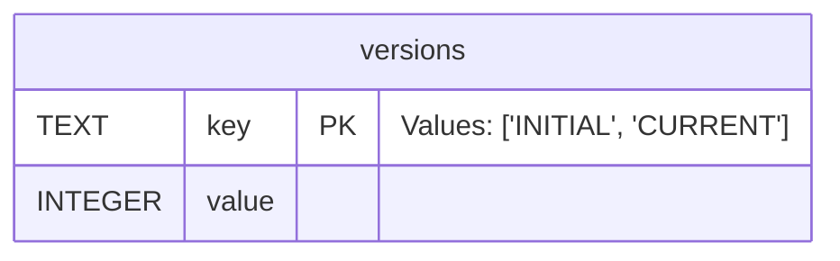

# :material-database-edit: Library Format

This page outlines the various changes made to the TagStudio library save file format over time, sometimes referred to as the "database" or "database file".

---

## JSON

Legacy (JSON) library save format versions were tied to the release version of the program itself. This number was stored in a `version` key inside the JSON file.

### Versions 1.0.0 - 9.4.2

| Used From | Format | Location                                      |
| --------- | ------ | --------------------------------------------- |
| v1.0.0    | JSON   | `<Library Folder>`/.TagStudio/ts_library.json |

The legacy database format for public TagStudio releases [v9.1](https://github.com/TagStudioDev/TagStudio/tree/Alpha-v9.1) through [v9.4.2](https://github.com/TagStudioDev/TagStudio/releases/tag/v9.4.2). Variations of this format had been used privately since v1.0.0.

Replaced by the new SQLite format introduced in TagStudio [v9.5.0 Pre-Release 1](https://github.com/TagStudioDev/TagStudio/releases/tag/v9.5.0-pr1).

---

## SQLite

Starting with TagStudio [v9.5.0-pr1](https://github.com/TagStudioDev/TagStudio/releases/tag/v9.5.0-pr1), the library save format has been moved to a [SQLite](https://sqlite.org) format. Legacy JSON libraries are migrated (with the user's consent) to the new format when opening in current versions of the program. The save format versioning is now separate from the program's versioning number.

Versions **1-100** stored the database version in a table called `preferences` in a row with the `key` column of `"DB_VERSION"` inside the corresponding `value` column.

Versions **>101** store the database version in a table called `versions` in a row with the `key` column of `'CURRENT'` inside the corresponding `value` column. The `versions` table also stores the initial database version in which the file was created with under the `'INITIAL'` key. Databases created before this key was introduced will always have `'INITIAL'` value of `100`.

### Versions 1 - 5

These versions were used while developing the new SQLite file format, outside any official or recommended release. These versions **were never supported** in any official capacity and were actively warned against using for real libraries.

---

### Version 6

| Used From                                                                       | Format | Location                                        |
| ------------------------------------------------------------------------------- | ------ | ----------------------------------------------- |
| [v9.5.0-pr1](https://github.com/TagStudioDev/TagStudio/releases/tag/v9.5.0-pr1) | SQLite | `<Library Folder>`/.TagStudio/ts_library.sqlite |

The first public version of the SQLite save file format.

Migration from the legacy JSON format is provided via a walkthrough when opening a legacy library in TagStudio [v9.5.0 Pre-Release 1](https://github.com/TagStudioDev/TagStudio/releases/tag/v9.5.0-pr1) or later.

---

### Version 7

| Used From                                                                       | Format | Location                                        |
| ------------------------------------------------------------------------------- | ------ | ----------------------------------------------- |
| [v9.5.0-pr2](https://github.com/TagStudioDev/TagStudio/releases/tag/v9.5.0-pr2) | SQLite | `<Library Folder>`/.TagStudio/ts_library.sqlite |

-   Repairs "Description" fields to use a TEXT_LINE key instead of a TEXT_BOX key.
-   Repairs tags that may have a disambiguation_id pointing towards a deleted tag.

---

### Version 8

| Used From                                                                       | Format | Location                                        |
| ------------------------------------------------------------------------------- | ------ | ----------------------------------------------- |
| [v9.5.0-pr4](https://github.com/TagStudioDev/TagStudio/releases/tag/v9.5.0-pr4) | SQLite | `<Library Folder>`/.TagStudio/ts_library.sqlite |

-   Adds the `color_border` column to the `tag_colors` table. Used for instructing the [secondary color](colors.md#secondary-color) to apply to a tag's border as a new optional behavior.
-   Adds three new default colors: "Burgundy (TagStudio Shades)", "Dark Teal (TagStudio Shades)", and "Dark Lavender (TagStudio Shades)".
-   Updates Neon colors to use the new `color_border` property.

---

### Version 9

| Used From                                                               | Format | Location                                        |
| ----------------------------------------------------------------------- | ------ | ----------------------------------------------- |
| [v9.5.2](https://github.com/TagStudioDev/TagStudio/releases/tag/v9.5.2) | SQLite | `<Library Folder>`/.TagStudio/ts_library.sqlite |

-   Adds the `filename` column to the `entries` table. Used for sorting entries by filename in search results.

---

### Version 100

| Used From                                                                                            | Format | Location                                        |
| ---------------------------------------------------------------------------------------------------- | ------ | ----------------------------------------------- |
| [74383e3](https://github.com/TagStudioDev/TagStudio/commit/74383e3c3c12f72be1481ab0b86c7360b95c2d85) | SQLite | `<Library Folder>`/.TagStudio/ts_library.sqlite |

-   Introduces built-in minor versioning
    -   The version number divided by 100 (and floored) constitutes the **major** version. Major version indicate breaking changes that prevent libraries from being opened in TagStudio versions older than the ones they were created in.
    -   Values more precise than this ("ones" through "tens" columns) constitute the **minor** version. These indicate minor changes that don't prevent a newer library from being opened in an older version of TagStudio, as long as the major version is not also increased.
-   Swaps `parent_id` and `child_id` values in the `tag_parents` table

#### Version 101

| Used From                                                               | Format | Location                                        |
| ----------------------------------------------------------------------- | ------ | ----------------------------------------------- |
| [v9.5.4](https://github.com/TagStudioDev/TagStudio/releases/tag/v9.5.4) | SQLite | `<Library Folder>`/.TagStudio/ts_library.sqlite |

-   Deprecates the `preferences` table, set to be removed in a future TagStudio version.
-   Introduces the `versions` table
    -   Has a string `key` column and an int `value` column
    -   The `key` column stores one of two values: `'INITIAL'` and `'CURRENT'`
    -   `'INITIAL'` stores the database version number in which in was created
        -   Pre-existing databases set this number to `100`
    -   `'CURRENT'` stores the current database version number

#### Version 102

| Used From                                                               | Format | Location                                        |
| ----------------------------------------------------------------------- | ------ | ----------------------------------------------- |
| [v9.5.4](https://github.com/TagStudioDev/TagStudio/releases/tag/v9.5.4) | SQLite | `<Library Folder>`/.TagStudio/ts_library.sqlite |

-   Applies repairs to the `tag_parents` table created in [version 100](#version-100), removing rows that reference tags that have been deleted.

#### Version 103

| Used From                                                               | Format | Location                                        |
| ----------------------------------------------------------------------- | ------ | ----------------------------------------------- |
| [#1139](https://github.com/TagStudioDev/TagStudio/pull/1139) | SQLite | `<Library Folder>`/.TagStudio/ts_library.sqlite |

-   Adds the `is_hidden` column to the `tags` table (default `0`). Used for excluding entries tagged with hidden tags from library searches.
-   Sets the `is_hidden` field on the built-in Archived tag to `1`, to match the Archived tag now being hidden by default.

#### Version 104

| Used From                                                               | Format | Location                                        |
| ----------------------------------------------------------------------- | ------ | ----------------------------------------------- |
| [v9.5.7](https://github.com/TagStudioDev/TagStudio/releases/tag/v9.5.7) | SQLite | `<Library Folder>`/.TagStudio/ts_library.sqlite |

- Adds a new `url_fields` table.
- Changes the type key of the `URL` and `SOURCE` fields to be `URL`.
- Migrates any records in the `text_fields` whose type key has the type `URL` (so, if their type is either `URL` or `SOURCE`) to the new `url_fields` table.
