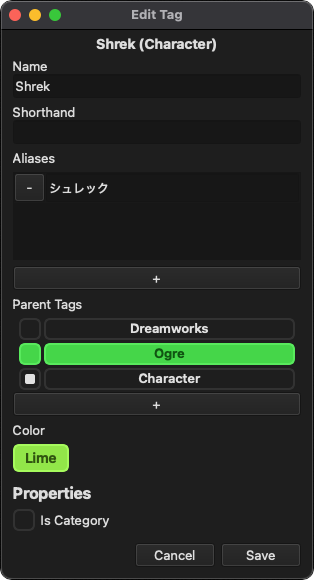

# Tags

Tags are discrete objects that represent some attribute. This could be a person, place, object, concept, and more. Unlike most tagging systems, TagStudio tags are not solely represented by a line of text or a hashtag. Tags in TagStudio consist of several properties and relationships that give extra customization, searching power, and ease of tagging that cannot be achieved by string-based tags alone. TagStudio tags are designed to be as simple or as complex as you'd like, giving options to users of all skill levels and use cases.

## Naming Tags

TagStudio tags do not share the same naming limitations of many other tagging solutions. The key standouts of tag names in TagStudio are:

-   Tag names do **NOT** have to be unique
-   Tag names are **NOT** limited to specific characters
-   Tags can have **aliases**, a.k.a. alternate names to go by

### Name

This is the base name of a tag. It does not have to be unique, and can use any characters you wish. If your tag can go by multiple names, for example if it's the name of a person or something that's commonly shortened or abbreviated, then it's recommended that you put the full tag name here.

### Shorthand

This is a special type of alias that's used for shortening the tag name under special circumstances, mostly when screen space is limited. Tag shorthands can be searched for just like tag names and tag aliases.

### Aliases

Aliases are alternate names that the tag can go by. This may include individual first names for people, alternate spellings, shortened names, and more. If there's a common abbreviation or shortened name for your tag, it's recommended to use the [shorthand](#shorthand) field for this instead.

When searching for a tag, aliases (including the shorthand) can also be used to find the tag. This not only includes searching for tags themselves, but for tagged [file entries](entry.md) as well!

### Automatic Disambiguation

Just as in real life, sometimes there are different attributes that share the same name with one another. The process of adding specificity to something in order to not confuse it with something similar is known as [disambiguation](https://en.wikipedia.org/wiki/Word-sense_disambiguation). In TagStudio we give the option to automatically disambiguate tag names based on a specially marked [Parent Tag](#parent-tags). Parent tags are explained in further detail below, but for the purposes of tag names they can lend themselves to clarifying the name of a tag without the user needing to manually change the name or add complicated aliases.

Given a tag named "Freddy", we may confuse it with other "Freddy" tags in our library. There are lots of Freddys in the world, after all. If we're talking about Freddy from "Five Nights at Freddy's", then we may already (and likely should) have a separate "Five Nights at Freddy's" tag added as a parent tag. When the disambiguation box next to a parent tag is selected (see image below) then our tag name will automatically display its name with that parent tag's name (or shorthand if available) in parentheses.

So if the "Five Night's at Freddy's" tag is added as a parent tag on the "Freddy" tag, and the disambiguation box next to it is checked, then our tag name will automatically be displayed as "Freddy (Five Nights at Freddy's)". Better yet, if the "Five Night's at Freddy's" tag has a shorthand such as "FNAF", then our "Freddy" tag will be displayed as "Freddy (FNAF)". This process preserves our base tag name ("Freddy") and provides an option to get a clean and consistent method to display disambiguating parent categories, rather than having to type this information in manually for each applicable tag.

## Tag Relationships

One of the core properties of tags in TagStudio is their ability to form relationships with other tags, just as attributes have relationships with each other in real life. A rectangle is a square, but a square isn't a rectangle. A certain plumber with a red hat and blue overalls might be part of a well-known media franchise, developed by an equally well-known company. But how do representing these relationships help with tagging images and files? With tag relationships, we can leverage the following principles:

1. [Simplicity via Deduplication](#simplicity-via-deduplication)
2. [Intuition via Substitution](#intuition-via-substitution)
3. [Rediscovery via Linking](#rediscovery-via-linking)

### Parent Tags

#### Simplicity via Deduplication

In a system where tags have no relationships, you're required to add as many tags as you possibly can to describe every last element of an image or file. If you want to tag an image of Shrek, you need to add a tag for `Shrek` himself, a `Character` tag since he's a character, a `Movie` and perhaps `Dreamworks` tag since he's a character from a movie, or perhaps a `Book` tag if we're talking about the original character, and then of course tags for every other attribute of Shrek shown or implied. By allowing tags to have inheritance relationships, we can have a single `Shrek` tag inherit from `Character` (Shrek IS a character) as well as from a separate `Shrek (Movie Franchise)` tag that itself inherits from `Movie Franchise` and `Dreamworks`. Now by simply adding the `Shrek` tag to an image, we've effectively also added the `Character`, `Shrek (Move Franchise)`, `Movie Franchise`, and `Dreamworks` attributes all in one go. On the image entry itself we only see `Shrek`, but the rest of the attributes are implied.

#### Intuition via Substitution

Now when searching for for images that have `Dreamworks` and `Character`, any images or files originally just tagged with `Shrek` will appear as you would expect. A little bit of tag setup goes a long way not only saving so much time during tagging, but also to ensure an intuitive way to search your files!

#### Rediscovery via Linking

Lastly, when searching your files with broader categories such as `Character` or `Dreamworks` you may rediscover images and files that you had simply tagged with tags such as `Barbatus` or `Tulio`, since you didn't need to manually tag those files with `Character` or `Dreamworks`, but had forgotten that they are both in fact Dreamworks characters. While you focus on tagging your files with seemingly surface level attributes, your TagStudio library is building rich connections between tags and files that may not be fully apparent until being discovered through various search queries. While you were simply tagging images with `Shrek` and `Tulio`, you may have unlocked an easy way to search for "2D Dreamworks Characters" without having to explicitly tag for that!

### Component Tags

**_[Coming in version 9.6](../updates/roadmap.md#v96)_**

Component tags will be built from a composition-based, or "HAS" type relationship between tags. This takes care of instances where an attribute may "have" another attribute, but doesn't inherit from it. Shrek may be an `Orge`, he may be a `Character`, but he is NOT a `Leather Vest` - even if he's commonly seen _with_ it. Component tags, along with the upcoming [Tag Override](tag_overrides.md) feature, are built to handle these cases in a way that still simplifies the tagging process without adding too much undue complexity for the user.

## Tag Appearance

### Color

Tags use a default uncolored appearance by default, however can take on a number of built-in and user-created colors and color palettes! Tag color palettes can be based on a single color value (see: TagStudio Standard, TagStudio Shades, TagStudio Pastels) or use an optional secondary color use for the text and optionally the tag border (e.g. TagStudio Neon).

#### User-Created Colors

Custom palettes and colors can be created via the [Tag Color Manager](./tag_color.md). These colors will display alongside the built-in colors inside the tag selection window and are separated by their namespace names. Colors which use the secondary color for the tag border will be outlined in that color, otherwise they will only display the secondary color on the bottom of the swatch to indicate at a glance that the text colors are different.

### Icon

**_[Coming in version 9.6](../updates/roadmap.md#v96)_**

## Tag Properties

Properties are special attributes of tags that change their behavior in some way.

#### Is Category

When the "Is Category" property is checked, this tag now acts as a category separator inside the preview panel. If this tag or any tags inheriting from this tag (i.e. tags that have this tag as a "[Parent Tag](#parent-tags)"), then these tags will appear under a separated group that's named after this tag. Tags inheriting from multiple "category tags" will still show up under any applicable category. _Read more under: [Tag Categories](../library/tag_categories.md)._

#### Is Hidden

**_[Coming in version 9.6](../updates/roadmap.md#v96)_**

When the "Is Hidden" property is checked, any file entries tagged with this tag will not show up in searches by default. This property comes by default with the built-in "Archived" tag.

## Tag Search Examples

The following are examples of how a set of given tags will respond to various search queries.

| Tag                 | Name                | Shorthand | Aliases                | Parent Tags                                  |
| ------------------- | ------------------- | --------- | ---------------------- | -------------------------------------------- |
| _League of Legends_ | "League of Legends" | "LoL"     | ["League"]             | ["Game", "Fantasy"]                          |
| _Arcane_            | "Arcane"            | ""        | []                     | ["League of Legends", "Cartoon"]             |
| _Jinx (LoL)_        | "Jinx Piltover"     | "Jinx"    | ["Jinxy", "Jinxy Poo"] | ["League of Legends", "Arcane", "Character"] |
| _Zander (Arcane)_   | "Zander Zanderson"  | "Zander"  | []                     | ["Arcane", "Character"]                      |
| _Mr. Legend (LoL)_  | "Mr. Legend"        | ""        | []                     | ["League of Legends", "Character"]           |

**The query "Arcane" will display results tagged with:**

| Tag             | Cause of Inclusion               | Tag Tree Lineage           |
| --------------- | -------------------------------- | -------------------------- |
| Arcane          | Direct match of tag name         | "Arcane"                   |
| Jinx (LoL)      | Search term is set as parent tag | "Jinx (LoL) > Arcane"      |
| Zander (Arcane) | Search term is set as parent tag | "Zander (Arcane) > Arcane" |

**The query "League of Legends" will display results tagged with:**

| Tag               | Cause of Inclusion                                     | Tag Tree Lineage                               |
| ----------------- | ------------------------------------------------------ | ---------------------------------------------- |
| League of Legends | Direct match of tag name                               | "League of Legends"                            |
| Arcane            | Search term is set as parent tag                       | "Arcane > League of Legends"                   |
| Jinx (LoL)        | Search term is set as parent tag                       | "Jinx (LoL) > League of Legends"               |
| Mr. Legend (LoL)  | Search term is set as parent tag                       | "Mr. Legend (LoL) > League of Legends"         |
| Zander (Arcane)   | Search term is a parent tag of a tag set as parent tag | "Zander (Arcane) > Arcane > League of Legends" |

Note: The query "LoL" will display the same results as the above example since "LoL" is the shorthand for "League of Legends".
