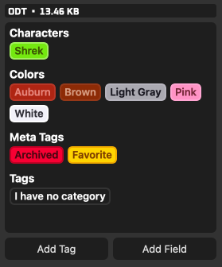

---
tags:
---

# Tag Categories

The "Is Category" property of tags determines if a tag should be treated as a category itself when being organized inside the preview panel. Tags marked as categories will show themselves and all tags inheriting from it (including recursively) underneath a field-like section with the tag's name. This means that duplicates of tags can appear on entries if the tag inherits from multiple parent categories, however this is by design and reflects the nature multiple inheritance. Any tags not inheriting from a category tag will simply show under a default "Tag" section.

### Built-In Tags and Categories

The built-in tags "Favorite" and "Archived" inherit from the built-in "Meta Tags" category which is marked as a category by default. This behavior of default tags can be fully customized by disabling the category option and/or by adding/removing the tags' Parent Tags.

### Migrating from v9.4 Libraries

Due to the nature of how tags and Tag Felids operated prior to v9.5, the organization style of Tag Categories vs Tag Fields is not 1:1. Instead of tags being organized into fields on a per-entry basis, tags themselves determine their organizational layout via the "Is Property" flag. Any tags _(not currently inheriting from either the "Favorite" or "Archived" tags)_ will be shown under the default "Tags" header upon migrating to the v9.5+ library format. Similar organization to Tag Fields can be achieved by using the built-in "Meta Tags" tag or any other marked with "Is Category" and then setting those tags as parents for other tags to inherit from.
