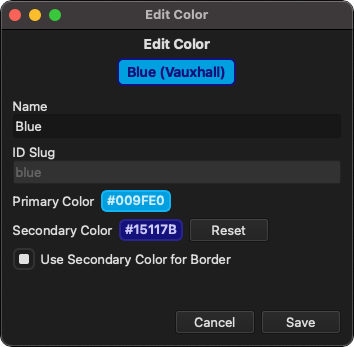
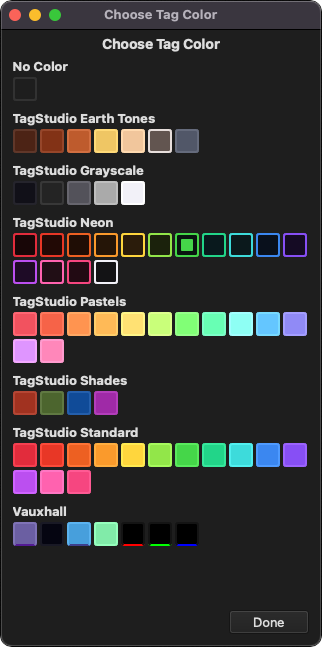

# Tag Colors

TagStudio features a variety of built-in tag colors, alongside the ability for users to create their own custom tag color palettes.

## Tag Color Manager

The Tag Color Manager is where you can create and manage your custom tag colors and associated namespaces. To open the Tag Color Manager, go to "File -> Manage Tag Colors" option in the menu bar.

## Creating a Namespace

TagStudio uses namespaces to group colors into palettes. Namespaces are a way for you to use the same color name across multiple palettes without having to worry about [name collision](https://en.wikipedia.org/wiki/Name_collision) with other palettes. This is especially useful when sharing your color palettes with others!\*

_\* Color pack sharing coming in a future update_

To create your first namespace, either click the "New Namespace" button or the large button prompt underneath the built-in colors.

### Name

The display name of the namespace, used for presentation.

### ID Slug

An internal ID for the namespace which is automatically derived from the namespace name.

Namespaces beginning with "tagstudio" are reserved by TagStudio and will automatically have their text changed.

<!-- prettier-ignore -->
!!! note
    It's currently not possible to manually edit the Namespace ID Slug. This will be possible once sharable color packs are added.

## Creating a Color

Once you've created your first namespace, click the "+" button inside the namespace section to create a color. To edit a color that you've previously created, either click on the color name or right click and select "Edit Color" from the context menu.

### Name

The display name for the color, used for presentation. You may occasionally see the color name followed by the [namespace name](#name) in parentheses to disambiguate it from other colors with the same name.

### ID Slug

Similar to [Namespace ID Slugs](#id-slug), the ID Slug is used as an internal ID and is automatically derived from the tag color name.

<!-- prettier-ignore -->
!!! note
    It's currently not possible to manually edit the Color ID Slug. This will be possible once sharable color packs are added.

### Primary Color

The primary color is used as the main tag color and by default is used as the background color with the text and border colors being derived from this color.

### Secondary Color

By default, the secondary color is only used as an optional override for the tag text color. This color can be cleared by clicking the adjacent "Reset" button.

The secondary color can also be used as the tag border color by checking the "Use Secondary Color for Border" box.

## Using Colors

When editing a tag, click the tag color button to bring up the tag color selection panel. From here you can choose any built-in TagStudio color as well as any of your custom colors.

