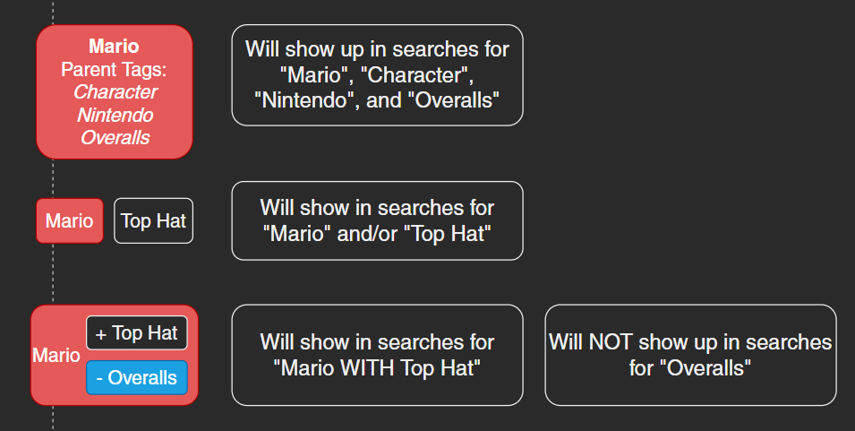
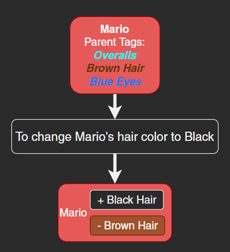

---
tags:
  - Upcoming Feature
---

# Tag Overrides

Tag overrides are the ability to add or remove [parent tags](tag.md#subtags) from a [tag](tag.md) on a per- [entry](entry.md) basis. Relies on the [Database Migration](../updates/db_migration.md) update being complete.

## Examples

<figure markdown="span">
  { height="300" }
  <figcaption>Ex. 1 - Comparing standard tag composition vs additive and subtractive inheritance overrides.</figcaption>
</figure>

<figure markdown="span">
  { height="300" }
  <figcaption>Ex. 2 - Parent tag swap using tag overrides.</figcaption>
</figure>
