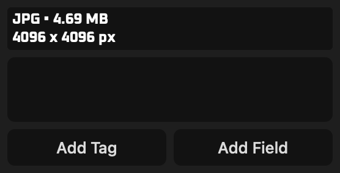
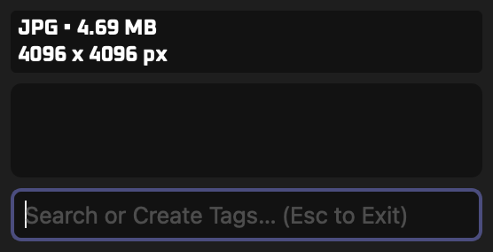
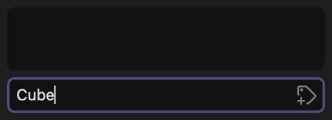
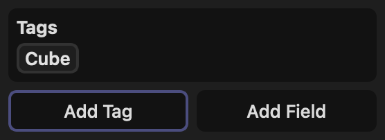
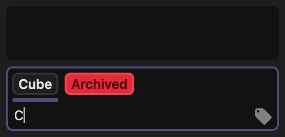
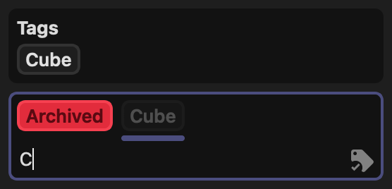
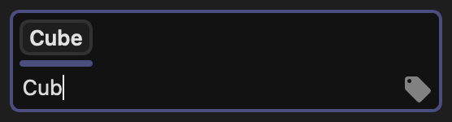
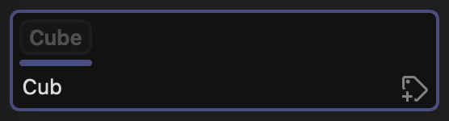
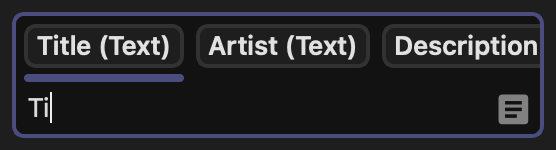

<!-- SPDX-FileCopyrightText: (c) TagStudio Contributors -->
<!-- SPDX-License-Identifier: GPL-3.0-only -->

# :material-mouse: Basic Usage

## :material-database-plus: Creating/Opening a Library

To create or open a [library](libraries.md), go to **File -> Open/Create Library** in the menu bar or use <kbd>Ctrl</kbd>+<kbd>O</kbd> (<kbd>⌘ Command </kbd>+<kbd>O</kbd> on macOS) and chose a folder with file contents you'd like to use as a TagStudio library. If a `.TagStudio` folder doesn't already exist inside the directory, TagStudio will create one and automatically scan the folder for files to include. Otherwise, the pre-existing library is opened.

### :material-database-refresh: Refreshing Directories

TagStudio automatically scans for new or updated files when opening a library by default. Manually refresh by going to **File -> Refresh Directories** in the menu or by using <kbd>Ctrl</kbd>+<kbd>R</kbd> (<kbd>⌘ Command </kbd>+<kbd>R</kbd> on macOS).

<!-- prettier-ignore -->
!!! abstract "TagStudio Libraries"
    To learn more about how TagStudio libraries work and how to use them, visit the **[Libraries](libraries.md)** page.

---

## :material-tag-text: Tagging

With one or more file entries selected, you can **search for** or **create a new tag** by clicking the "Add Tag" button at the bottom of the inspector or by pressing <kbd>Ctrl</kbd>+<kbd>T</kbd>.

This will open the the **"Tag Bar"**, a combination search/creation bar that is designed to allow you to quickly create and apply tags that don't exist yet, find and apply existing tags from your library, and verify if certain tags already exist and/or are applied to your selection.

Every step is keyboard-friendly, allowing for an efficient tagging "flow state" when it comes to creating and applying tags.

<figure markdown="span">
  { width=80% }
   
  { width=80% }
  <figcaption>
  Clicking "Add Tag" or pressing <kbd>Ctrl</kbd>+<kbd>T</kbd> replaces the "Add" buttons with a tag search bar.
   
  You can close the search by pressing <kbd>Enter</kbd> or clicking away (with a blank search), or at any time by pressing <kbd>Esc</kbd>.
  </figcaption>
</figure>

<!-- prettier-ignore -->
!!! note "Classic Tag Search Panel"
    You can access the classic tag search panel by going to **File -> Add Tag to Selected** in the menu bar, or by pressing <kbd>Shift</kbd>+<kbd>Ctrl</kbd>+<kbd>T</kbd>. Note that this panel will change and move in the future, becoming part of a set of dockable side-panels for tagging that can stay open between making selections. See the [roadmap](./roadmap.md#uiux) for more info.

### :material-tag-plus: Tag Bar: Creating Tags

Type to search for an existing tag, or use that search term to quickly create and apply a new tag to your selection. Pressing <kbd>Enter</kbd> with **no results** will **create** :material-tag-plus-outline: a tag from your search query and apply it to the selected entries.

After applying a tag, the "Add Tag" button is now focused, allowing you to press <kbd>Enter</kbd> or <kbd>Space</kbd> to quickly reactivate the bar. Alternatively, you may edit your new tag by right-clicking the tag and selecting **"Edit"**.

Tags can be also viewed, created, edited, or deleted from the **Edit -> Manage Tags** window.

<figure markdown="span">
  { width=80% }
  <figcaption>A tag named "Cube" does not exist yet, and will be created and applied to the selection when <kbd>Enter</kbd> is pressed.</figcaption>
  { width=80% }
  <figcaption>The new tag "Cube" has been created and applied to our selection.</figcaption>
</figure>

<!-- prettier-ignore -->
!!! tip "Optionally Always Edit New Tags"
    If you prefer opening an "Edit" window for tags after creating them and before they get applied to your selection, you can toggle this option on by right-clicking the search bar and clicking **"Edit After Creating a New Tag"**, or by visiting the same setting in the **Settings** window. By default, this option is **off.**

### :material-tag-search: Tag Bar: Searching for Tags

Pressing <kbd>Enter</kbd> with **one or more results** will **apply** :material-tag: the underlined tag to your selection (assuming it's not already on your selection).

Matching tags that are **already applied** :material-tag-check: to your entries will be greyed out placed at the end of the autofill results. This lets you visually confirm that a tag already exists and has been applied to the selection. Applying them again with <kbd>Enter</kbd> has no effect other than closing the search.

You can navigate the list of autofill suggestions using the scroll wheel, and change the selected tag by pressing <kbd>Tab</kbd> or <kbd>Shift</kbd>+<kbd>Tab</kbd> to navigate right and left, respectively.

<figure markdown="span">
  { width=80% }
  <figcaption>On a new selected entry, typing "Cube" will find our existing tag.</figcaption>
  { width=80% }
  <figcaption>If the matched tag is already applied to the selected entries, it will be greyed out and ignored when pressing <kbd>Enter</kbd>.</figcaption>
</figure>

#### :material-tag-arrow-up: Force Create Tag

Holding <kbd>Shift</kbd> while pressing <kbd>Enter</kbd> will **force create** :material-tag-plus-outline: a tag from the search bar text, regardless of the search results. This is especially useful when you need to create a new tag with a name that partially overlaps with an existing tag's name.

<figure markdown="span">
  { width=80% }
  <figcaption markdown="span">Pressing <kbd>Enter</kbd> will **apply** :material-tag: the underlined tag, "Cube".</figcaption>
  { width=80% }
  <figcaption markdown="span">
  <kbd>Shift</kbd>+<kbd>Enter</kbd> will **create** :material-tag-plus-outline: a new tag called "Cub".
   
  Note the the greyed-out tag, showing it will not be applied.
  </figcaption>
</figure>

---

## :material-text-box: Creating and Adding Fields

[Fields](./fields.md) are extra pieces of information you can add to file entries, such as titles, comments, notes, specific dates or times. Unlike tags, fields are based on [templates](./fields.md#field-templates) that contain pre-filled information such as the field type and title, and that information is _copied_ to fields when adding them to entries. Editing field information on entries **does not** modify the template it was created from.

Creating and adding fields to entries is extremely similar to how [tagging](#tagging) works, with a few notable differences:

- Click "Add Field" or press <kbd>Ctrl</kbd>+<kbd>L</kbd> to open the field bar.
- The same template can by applied to an entry any number of times.
- New field templates are automatically edited after being created, since they have a type that must be chosen before they can be used.
    - This is separate from the option to automatically edit a field's _contents_ once a field has been added to an entry
- Editing a field's contents immediately after it's added to an entry is **enabled** by default, and can be toggled by right-clicking the search bar and clicking **"Edit After Adding a Field"**, or by visiting the same setting in the **Settings** window.

<figure markdown="span">
  { width=80% }
  <figcaption>Searching for field templates inside the field bar.</figcaption>
</figure>

---

## Relinking Moved Files

Inevitably some of the files inside your library will be renamed, moved, or deleted. If a file has been renamed or moved, TagStudio will display the thumbnail as a red broken chain link. To relink moved files or delete these entries, select the "Manage Unlinked Entries" option under the Tools menu. Click the "Refresh" button to scan your library for unlinked entries. Once complete, you can attempt to "Search & Relink" any unlinked file entries to their respective files, or "Delete Unlinked Entries" in the event the original files have been deleted and you no longer wish to keep their entries inside your library.

<!-- prettier-ignore -->
!!! warning
    There is currently no method to relink entries to files that have been renamed - only moved or deleted. This is a high priority for future releases.

<!-- prettier-ignore -->
!!! warning
    If multiple matches for a moved file are found (matches are currently defined as files with a matching filename as the original), TagStudio will currently ignore the match groups. Adding a GUI for manual selection, as well as smarter automated relinking, are high priorities for future versions.

---

## Launch Arguments

There are a handful of launch arguments you can pass to TagStudio via the command line or a desktop shortcut.

| Argument                 | Short | Description                                            |
| ------------------------ | ----- | ------------------------------------------------------ |
| `--cache-file <path>`    | `-c`  | Path to a TagStudio .ini or .plist cache file to use.  |
| `--open <path>`          | `-o`  | Path to a TagStudio Library folder to open on start.   |
| `--settings-file <path>` | `-s`  | Path to a TagStudio .toml global settings file to use. |
| `--version`              | `-v`  | Displays TagStudio version information.                |
